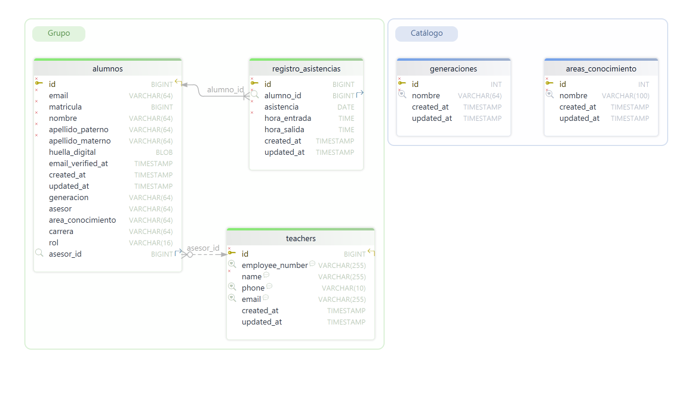
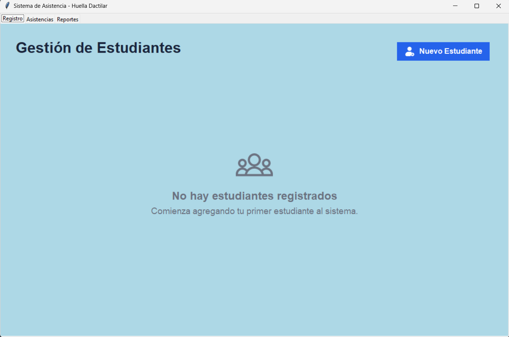
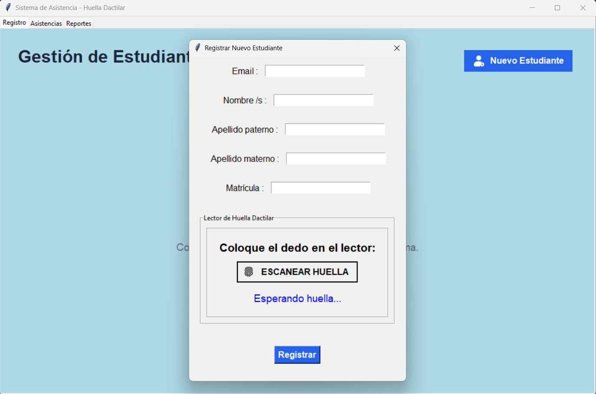
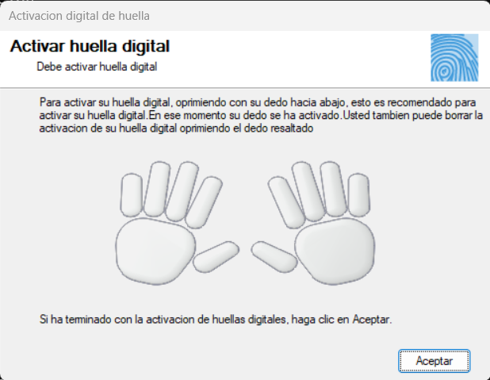
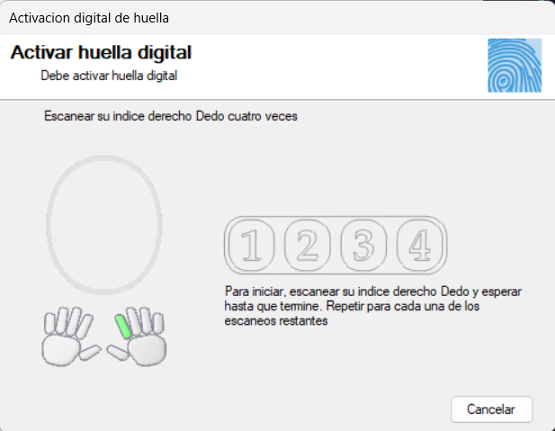
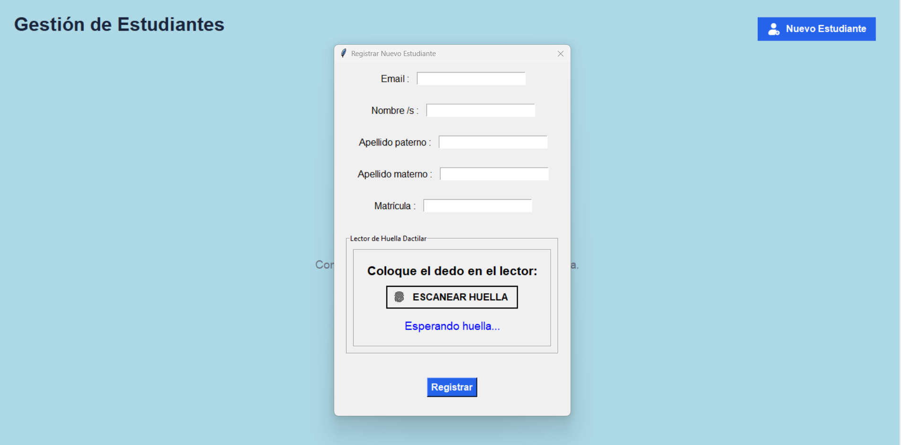
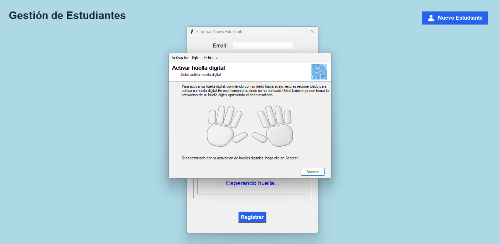
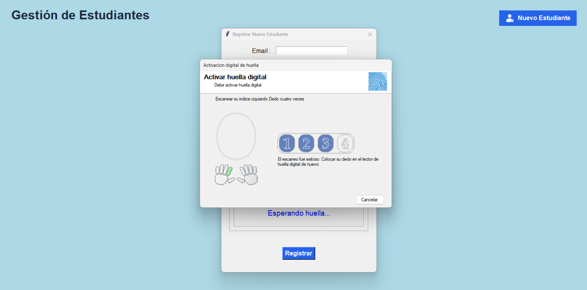
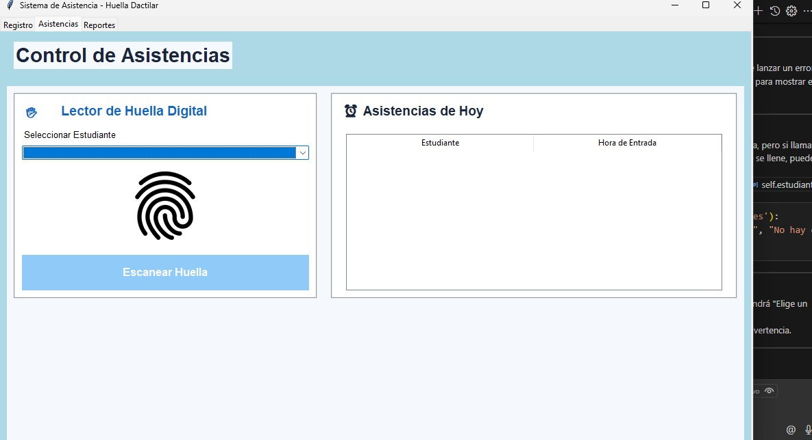
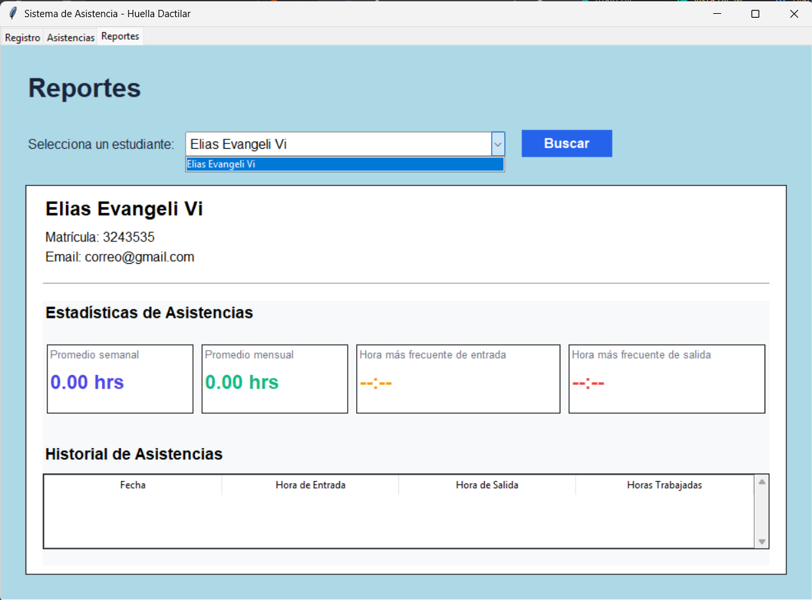

# Desarrollo del programa lector biometrico por medio de huella digital

Para comenzar a desarrollar el programa primero tenemos que conocer los requerimientos funcionales, escojer las herramientas a utilizar (lenguaje de progrmación, IDE, base de datos, etc.). Como lenguaje de programación se va a usar **python** y **Visual Studio Code** como editor de código.

## 1. Diseño de la base de datos
En este proyecto usaremos **MySQL** y el manejador **DbSchema** para crear la BD. Al definir las tablas, las columnas, tipo de dato y la relación, el diagrama de la BD seria asi:



## 2. Crear el proyecto en un entorno virtual
El entorno virtual servirá para alojar y desarrollar el proyecto de forma local. Primero creamos una carpeta vacia, en este caso la carpeta del proyecto estará en el escritorio y tendra por nombre `asistencia_biometrica`, para la creación del **entorno virtual** ejecutamos el siguiente comando en la terminal desde la carpeta recien creada:
```bash
python -m venv env
```
Esto creará un folder llamado **env**, ese folder es el **entorno virtual**. Para utilizar el entorno virtual primero se tiene que activar usando el comando:
```bash
.\env\scripts\activate
```
Si el **env** se activo de forma correcta la terminal se verá así:
```bash
(env) PS C:\Users\Desktop\asistencia_biometrica>
```
Una vez activado el **env** abrimos **VS Code** ejecutando:
```bash
code .
```
De esta manera se habrirá **VS Code** con nuestro folder del proyecto **asistencia_biometrica**.

## 3. Estructura del proyecto
De momento el folder principal solo tiene un directorio y es el **env**. Para el desarrollo del programa se utilizará la arquitectura de ***Modelo Vista Controlador*** **(MVC)**.
La estructura del software será:
```
asistencia_biometrica/
│
├── app/
│   ├── controllers/      # Lógica de controladores (manejan la lógica de negocio)
│   ├── models/           # Modelos (interacción con la base de datos)
│   ├── views/            # Vistas (interfaz de usuario)
│   └── utils/            # Utilidades y funciones auxiliares
│
├── config/               # Configuración (DB, variables de entorno)
│
├── public/               # Archivos estáticos (imágenes, CSS, JS)
│
├── tests/               # Primeras pruebas de la API del lector de huellas
│
├── requirements.txt      # Dependencias descargadas
├── README.md             # Documentación del proyecto
└── main.py               # Punto de entrada principal
```
De momento esta será la estructura, esto puede cambiar durante el desarrollo del programa.

## 4. Descargar drivers del lector de huella
Instalarlos en la PC.

## 5. Conexión a la BD
Para conectar la BD SQL se usa la dependencia `mysql-connector-python`.
Instalamos el paquete:
```bash
pip install mysql-connector-python
```
También, vamos a instalar `python-dotenv` para manejar las credenciales (host, usuario, password, nombre de la base de datos) de acceso a la BD como variables de entorno.
```bash
pip install python-dotenv
```
En el directorio **config** cremos un archivo de conexión llamado **conexionBD.py** y otro llamado simplemente **.env** (ahí estaran los datos de acceso a la BD), así no tendremos que poner las credenciales de acceso directo en el código. El **.env** quedaría de la siguiente forma:
```env
HOST=**********
USER=**********
PASSWORD=********
DB_NAME=*********
```
En **conexionBD.py** escribimos el siguiente código:
```python
import mysql.connector
import os
from dotenv import load_dotenv

load_dotenv(dotenv_path="config/.env")
# Función para obtener una conexión a la base de datos
def obtenerConexion():
    try:
        conexion = mysql.connector.connect(
            host=os.getenv("HOST"),
            user=os.getenv("USER"),
            password=os.getenv("PASSWORD"),
            database=os.getenv("DB_NAME"),
            # ssl_disabled=False  # Mejor sería configurar SSL correctamente
        )

        if conexion.is_connected():
            print("Conexión exitosa a la base de datos")
    
        return conexion
    except mysql.connector.Error as err:
        print(f"Error de conexión: {err}")
        return None
    except Exception as e:
        print(f"Error inesperado: {e}")
        return None
```
En el `try` accedemos en la variables de entorno antes declaradas en **.env**.

## 6. Una interfaz sencilla
Para las interfaces vamos a utilizar la libreria `tkinter` que ya viene incluida en `python`, asi que no se tiene que instalar nada, solamente se importa.
Creamos el archivo **vista.py** en la carpeta **app/views**, y hacemos una ventana sencilla:
```python
import tkinter as tk

def ventanaPrincipal():
    # Crear una ventana principal de Tkinter
    ventana = tk.Tk()
    ventana.title("Asistencia Biometrica")
    ventana.geometry("900x700")
    ventana.config(bg="lightblue")

    etiqueta_h1 = tk.Label(
        ventana, 
        text="Registro de Asistencia Biometrica", 
        font=("Arial", 16, "normal"), 
        bg="lightblue", 
        bd=10, 
        cursor="hand2",
        state="normal",  # Estado normal para que el texto sea visible
        disabledforeground="skyblue"  # Color del texto cuando está deshabilitado
    )
    etiqueta_h1.pack()

    ventana.mainloop()
```

## 7. La función `main`
Para ejecutar todo el programa vamos a definir una función `main` en la raiz del proyecto en un archivo homónimo:
```py
from config.conexionBD import obtenerConexion

def main():
    db = obtenerConexion()
    if not db:
        print("No se pudo conectar a la base de datos.")
        return
    
    from app.views.vista import ventanaPrincipal
    ventanaPrincipal()
    
    db.close()
    
if __name__ == "__main__":
    main()
```
Importamos la función `obtenerConexion` para inicializar la conexión a la BD en la función `main`. Además, dentro de `main` importamos la `ventanaPrincipal`, aquí más adelante vamos a importar los controladores. Y por último lo declaramos como main en el `if __name__ = "__main__":`.

Ahora, al ejecutar `main.py` se iniciaría la conexión a la BD y se abriría la ventana principal.

```bash
python main.py
```

## 8. Generar el archivo de requerimientos
Este archivo indica las librerias (y sus versiones) que se han instalado en el **env**, y se genera con el comando:
```bash
pip freeze > requirements.txt
```

## 9. Desarrollo de la vista
La interfaz constará de 3 pestañas principales para navegar en el programa; **Registro**, **Asistencias** y **Reportes**.

### 1. La pestaña ***Registro***:
Aquí se mostrarán todos los estudiantes registrados con sus datos, opción de edición y eliminación. Además, habrá un botón para añadir nuevos alumnos para lo cual se usará el lector de huella. 



El registro de nuevos estudiantes se hará en un modal:


## La clase `Modelo`
La clase `Modelo` en **MVC** se encarga de la **gestión de datos** y **la lógica de negocio**. Recibe la conexión a la base de datos (`db`) y expone métodos para consultar, insertar, actualizar y eliminar datos relacionados con estudiantes y las asistencias.
```python
class Modelo:
    def __init__(self, db):
        self.db = db
        self.cursor = db.cursor()

    # Agregar un nuevo estudiante
    def registrar_estudiante(self, email, matricula, nombre, apellido_p, apellido_m, fecha_registro):
        self.cursor.execute(
            "INSERT INTO alumnos (email, matricula, nombre, apellido_paterno, apellido_materno, created_at) VALUES (%s, %s, %s, %s, %s, %s)",
            (email, int(matricula), nombre, apellido_p, apellido_m, fecha_registro)
        )
        self.db.commit()
```

## La clase `Controlador`
La clase `Controlador` en **MVC** es el intermediario entre la `Vista` y el `Modelo`. Recibe eventos de la vista (por ejemplo, clics en botones), llama a los métodos del modelo para manipular datos y actualiza la vista según sea necesario.
```python
from datetime import datetime

class Controlador:
    def __init__(self, modelo, vista):
        self.modelo = modelo
        self.vista = vista

        # Conectar eventos de la vista con métodos del controlador
        self.vista.set_controlador(self)


    def registrar_estudiante(self, email, matricula, nombre, apellido_p, apellido_m):
        fecha_registro = datetime.now().astimezone().strftime("%Y-%m-%d %H:%M:%S")
        self.modelo.registrar_estudiante(email, matricula, nombre, apellido_p, apellido_m, fecha_registro)
```

## La relación entre la `Vista` y el `Controlador`
Desde la clase `VentanaPrincipal` (la vista) declaramos el método `set_controlador` para que pueda recibir y guardar una referencia al `Controlador`.
```python
class VentanaPrincipal:
    def __init__(self):
        # ...Código existente...
        self.controlador = None  # Inicializa el atributo controlador

    def set_controlador(self, controlador):
        self.controlador = controlador
```

Así la clase `VentanaPrincipal` (la Vista) podrá llamar a métodos del `Controlador` cuando ocurra una acción del usuario.
```python
def guardar():
    email = entry_email.get()
    nombre = entry_nombre.get()
    apellido_p = entry_apellido_p.get()
    apellido_m = entry_apellido_m.get()
    matricula = entry_matricula.get()
    if email and matricula and nombre and apellido_p and apellido_m:
        # Validar que la matrícula sea un número
        if matricula.isdigit():
            self.controlador.registrar_estudiante(email, matricula, nombre, apellido_p, apellido_m)
            messagebox.showinfo("Estudiante registrado",
                            f"Email: {email}\nNombre: {nombre} {apellido_p} {apellido_m}\nMatrícula: {matricula}")
            modal.destroy()
        else:
            messagebox.showerror("Error", "La matrícula debe ser un número.")
    else:
        messagebox.showwarning("Campos vacíos", "Por favor, completa todos los campos.")
```

## Actualización del módulo `main`
En un programa con arquitectura **Modelo Vista Controlador (MVC)**, el `main.py` debe encargarse de **inicializar** los componentes principales y de conectar el `modelo`, la `vista` y el `controlador`.

Este `main` contenerá:
1. **Inicialización del modelo** (acceso a datos, lógica de negocio).
2. **Inicialización de la vista** (interfaz gráfica).
3. **Inicialización del controlador**, que recibe referencias al modelo y la vista, y se encarga de la lógica de interacción entre ambos.
4. **Arranque del bucle principal de la vista**.

```python
from config.conexionBD import obtenerConexion
from app.models.modelo import Modelo
from app.views.vista import VentanaPrincipal
from app.controllers.controlador import Controlador

def main():
    db = obtenerConexion()
    if not db:
        print("No se pudo conectar a la base de datos.")
        return
    
    modelo = Modelo(db)
    vista = VentanaPrincipal()
    controlador = Controlador(modelo, vista)
    vista.mostrar()
    
    db.close()
    
if __name__ == "__main__":
    main()
```

### ¿Cómo se relacionan Modelo, Vista y Controlador?
+ **Modelo:** Gestiona los datos y la lógica de negocio. No sabe nada de la vista ni del controlador.
+ **Vista:** Muestra la interfaz al usuario. Recibe eventos del usuario y los pasa al controlador.
+ **Controlador:** Recibe eventos de la vista, actualiza el modelo y puede actualizar la vista según sea necesario.

### Relación:
+ El **controlador** es el intermediario entre la **vista** y el **modelo**.
+ La **vista** notifica al **controlador** de las acciones del usuario.
+ El **controlador** actualiza el **modelo** y, si es necesario, actualiza la **vista**.

## La conexión del lector de huellas `U.are.U 4500`
En este proyecto se utilizará el lector de huellas `U.are.U 4500 Fingerprint Reader`, es un dispositivo biométrico USB que se utiliza para la autenticación de usuarios mediante huellas dactilares. Este lector está diseñado para ser utilizado en entornos individuales y compartidos, ofreciendo una solución compacta y profesional que conserva espacio en el escritorio.


El `U.are.U 4500` utiliza tecnología de escaneo óptico para capturar imágenes de alta calidad de las huellas dactilares, con una resolución de 512 ppp y un área de captura de 15 x 18 mm.

### La instalación de los Drivers
En el folder `SDK-DigitalPersona-main` encontraremos los siguientes archivos:
```
SDK-DigitalPersona-main/
│
├── Docs/
│   ├── EULA SDK.rtf      
│   ├── Fingerprint Guide.pdf
│   ├── One Touch for Windows SDK .NET Developer Guide.pdf
│   ├── One Touch for Windows SDK C-C++ Developer Guide.pdf
│   ├── One Touch for Windows SDK COM-ActivateX Developer Guide.pdf
│   ├── One Touch for Windows SDK Java Developer Guide.pdf
│   ├── One Touch for Windows XPE Dependencies.xls
│   ├── Session0_Vista.doc
│   └── Thumbs.db
│
├── Misc/
│   └── Citrix Support/
│       └── DPICACnt.dll
│
├── Redist/
│   ├── Muchos archivos .msm
│   └── Tres pdfs
│
├── RTE/ 
│   ├── Install/
│   └── Setup.exe
│
├── SDK/
│   ├── Install/
│   └── Setup.exe
│
├── Third-Party Software/
│
└── README.md
```


**Primero** instalamos el `SDK/Setup.exe` (los drivers), haciendo clic en **Next**, **Next**, **Next** en el instalador. Con esto, nuestra PC reconocerá el `U.aare.U 4500` cuando este conectado.

Además, la instalación crea una carpeta llamada `DigitalPersona` en `C:\Program Files\`. Dicho folder contiene el **SDK** (One Touch SDK), pero está diseñado principalmente para .NET, C/C++ y Java (aunque tambien podemos usar **Python** con la librería `ctypes`). Cada lenguaje soportado tiene su propia carpeta con programas de ejemplos de uso (folder `Samples`), documentación (folder `Docs`) y demas carpetas y archivos.

Para comprobar que el lector funciona correctamente podemos probar uno de estos programas siguiendo las instrucciones de la documentación que viene en PDF.

### La implementación del SDK
El **SDK** del lector `U.are.U 4500` usa un archivo con extención `.dll` para comunicarse con el dispositivo y procesar las huellas. Un archivo `.dll` significa *Dynamic Link Library*, es básicamente una colección de funciones y recursos que pueden ser usadas por varios programas al mismo tiempo. Contiene código compilado que puede realizar tareas específicas, como acceder al hardware del lector de huellas.

El archivo `.dll` se crea al instalar el `RTE/Setup.exe`. De modo que el **segundo paso** sería instalar el `RTE/Setup.exe` de la misma manera que instalamos `SDK/Setup.exe`. Si leemos el documento `SDK-DigitalPersona-main/Docs/One Touch for Windows SDK C-C++ Developer Guide.pdf`; pagina 16, se nos muestra una tabla con todas las carpetas y archivos que se crean en `C:\Program Files\DigitalPersona` al instalar `RTE/Setup.exe`. Sin embargo, **no todos** los archivos se crean en esa dirección, (en mi caso) la mayoria de los archivos `.dll` se crearon en `C:\Windows\System32` y `C:\Windows\SysWOW64`. Por lo tanto, al implementar el SDK usaremos una de esas rutas.

#### Código simple para comprobar la conexión
Una vez ya instalados el `SDK/Setup.exe`, el `RTE/Setup.exe` y conociendo las rutas de los `.dll`, podemos crear un pequeño "binding" básico en python:


1. Conectamos el lector `U.are.U 4500` a la computadora. 
2. Tendremos que utilizar `ctypes` para conectar Python con las funciones del SDK, asi que lo instalamos en el **env**.
```bash
pip install pywin32
```
3. Cramos un nuevo folder llamado `tests` en la raiz de nuestro proyecto y dentro hacemos un archivo `binding.py`.
4. Desde el **env** usamos la terminal para ubicarnos en esa nueva carpeta, para ejecutar el `binding.py` de forma aislada del `main`:
```bash
cd tests
```
5. Podemos comenzar probando si `dpHFtrEx.dll` se puede cargar y si se puede llamar a una función sencilla como `FX_init`.
```python
import ctypes

# Ruta completa a la DLL
dll_path = "C:\\Windows\\System32\\dpHFtrEx.dll"

# Cargar la DLL
dpHFtrEx = ctypes.WinDLL(dll_path)

# Llamar a la función FX_init
res = dpHFtrEx.FX_init()
print("Resultado de FX_init:", res)
```
Si imprime `Resultado de FX_init: 0` vamos bien.

#### Uso del `User Interfaces API Reference`
El capítulo ***User Interface API Reference*** del documento **SDK-DigitalPersona-main/Docs/One Touch for Windows SDK C-C++ Developer Guide.pdf** SDK de DigitalPersona describe una interfaz de alto nivel que simplifica el uso de las funciones biométricas mediante componentes predefinidos.

Estas funciones están diseñadas para facilitar la integración rápida de interfaces biométricas sin tener que construirlas desde cero. Para hacer una rápida implementación vamo usar esta API de interfaces.

1. Creamos un nuevo archivo en **tests**, llamado `uiSDK.py`
2. El lector tiene que esta conectado a la PC.
3. Ejecutamos el siguiente cógigo:
```python
import ctypes
from ctypes import wintypes

# 1. Cargar la DLL de la interfaz de usuario
dpfpui = ctypes.WinDLL("C:\\Windows\\System32\\DPFPUI.dll")  # Asegúrate que esté en el PATH

# 2. Definir estructuras y tipos necesarios
class DATA_BLOB(ctypes.Structure):
    _fields_ = [("cbData", ctypes.c_ulong), 
                ("pbData", ctypes.POINTER(ctypes.c_ubyte))]

# 3. Definir constantes
DP_ENROLLMENT_ADD = 0
DP_ENROLLMENT_DELETE = 1

# 4. Configurar los callbacks (funciones de retorno)
@ctypes.WINFUNCTYPE(ctypes.HRESULT, wintypes.HWND, ctypes.c_int, ctypes.c_uint, ctypes.POINTER(DATA_BLOB), ctypes.c_void_p)
def enrollment_callback(hWnd, action, finger_index, p_template, user_data):
    if action == DP_ENROLLMENT_ADD:
        template_data = bytes(p_template.contents.pbData[:p_template.contents.cbData])
        print(f"✅ Huella {finger_index} registrada. Tamaño:", len(template_data))
        # Aquí guardarías en tu base de datos
    elif action == DP_ENROLLMENT_DELETE:
        print(f"❌ Huella {finger_index} eliminada")
    return 0  # S_OK

@ctypes.WINFUNCTYPE(ctypes.HRESULT, wintypes.HWND, ctypes.POINTER(DATA_BLOB), ctypes.c_void_p)
def verification_callback(hWnd, p_feature_set, user_data):
    feature_data = bytes(p_feature_set.contents.pbData[:p_feature_set.contents.cbData])
    print("🔒 Huella recibida para verificación")
    # Aquí compararías con tus registros
    return 0  # S_OK si coincide, otro valor si no

# 5. Configurar las funciones de la UI
dpfpui.DPEnrollUI.restype = ctypes.HRESULT
dpfpui.DPEnrollUI.argtypes = [
    wintypes.HWND,          # Ventana padre (None para consola)
    ctypes.c_ushort,        # Máximo de dedos a registrar
    ctypes.POINTER(ctypes.c_ulong),  # Máscara de dedos registrados
    ctypes.c_void_p,        # Callback
    ctypes.c_void_p         # Datos de usuario
]

dpfpui.DPVerifyUI.restype = ctypes.HRESULT
dpfpui.DPVerifyUI.argtypes = [
    wintypes.HWND,          # Ventana padre
    ctypes.c_void_p,        # Callback
    ctypes.c_wchar_p,       # Título
    ctypes.c_wchar_p,       # Texto descriptivo
    wintypes.HBITMAP,       # Imagen de banner (None)
    ctypes.c_void_p         # Datos de usuario
]

# 6. Función para mostrar la interfaz de registro
def registrar_huella():
    enrolled_mask = ctypes.c_ulong(0)
    print("🖐️ Mostrando interfaz de registro...")
    result = dpfpui.DPEnrollUI(
        None,               # Sin ventana padre
        10,                 # Máximo 10 dedos
        ctypes.byref(enrolled_mask),
        enrollment_callback, # Nuestra función
        None                # Sin datos extra
    )
    print("Resultado del registro:", result)

# 7. Función para mostrar la interfaz de verificación
def verificar_huella():
    print("🔍 Mostrando interfaz de verificación...")
    result = dpfpui.DPVerifyUI(
        None,               # Sin ventana padre
        verification_callback,
        "Verificación de Huella",  # Título
        "Coloque su dedo en el lector",  # Instrucciones
        None,               # Sin imagen
        None                # Sin datos extra
    )
    print("Resultado de verificación:", result)

# 8. Ejemplo de uso
if __name__ == "__main__":
    print("1. Registrar huella")
    print("2. Verificar huella")
    opcion = input("Seleccione una opción: ")
    
    if opcion == "1":
        registrar_huella()
    elif opcion == "2":
        verificar_huella()
```
Esto muestra un mini menú:
```bash
(env) PS C:\direccion\del\proyecto\asistencia-biometrica\tests> python uiSDK.py
1. Registrar huella
2. Verificar huella
Seleccione una opción: |
```
Si seleciiona la opcion 1, se abrirá la siguiente ventana:



Ahí el usuario hace click al dedo que va a escanear. En este caso se escogio el indice derecho:



Posteriormente se coloca el dedo en el lector de huellas 4 veces.

## Implementación del `User Interface API` al **MVC**
En la carpeta `app/views` creamos un nuevo archivo llamado `interfaceApi.py` para orientar la `API de interfaz de usuario` a objetos.

### La clase InterfaceApi
Creamos la clase `InterfaceApi` que sirve para manejar el sistema de lectura de huellas digitales usando la DLL `DPFPUI.dll` de Windows (recordemos que esos archivos se craron cuando instalamos `RTE/Setup.exe` del **SDK**).

#### 1. Objetivo de la clase
La clase encapsula toda la lógica para:
+ Registrar huellas digitales (enrollment).
+ Verificar huellas digitales (verification).
+ Manejar callbacks (funciones que se ejecutan cuando hay eventos, como agregar o eliminar huellas).

#### 2. Carga de la DLL
```python
class InterfaceApi:
    """Clase principal para manejar las interfaces biométricas"""
    
    def __init__(self, dll_path: str = "C:\\Windows\\System32\\DPFPUI.dll"):
        """
        Inicializa el sistema biométrico
        :param dll_path: Ruta a la DLL de la interfaz de usuario
        """
        self._load_dll(dll_path)
        self._setup_callbacks()
        self._configure_functions()

    def _load_dll(self, dll_path: str):
        """Carga la DLL y verifica su disponibilidad"""
        try:
            self.dpfpui = ctypes.WinDLL(dll_path)
        except OSError as e:
            raise RuntimeError(f"No se pudo cargar la DLL: {e}") from e
```
+ Desde el constructor `__init__` se usa `ctypes` para cargar la librería nativa `DPFPUI.dll` que contiene las funciones para manejar la interfaz de usuario del lector de huellas.

+ Si la **DLL** no se encuentra o falla, lanza un error.

#### 3. Configuración de callbacks
```python
    def _setup_callbacks(self):
        """Configura los callbacks como métodos de instancia"""
        self._enrollment_callback = ctypes.WINFUNCTYPE(
            ctypes.HRESULT, 
            wintypes.HWND, 
            ctypes.c_int, 
            ctypes.c_uint, 
            ctypes.POINTER(DATA_BLOB), 
            ctypes.c_void_p
        )(self._handle_enrollment)
        
        self._verification_callback = ctypes.WINFUNCTYPE(
            ctypes.HRESULT, 
            wintypes.HWND, 
            ctypes.POINTER(DATA_BLOB), 
            ctypes.c_void_p
        )(self._handle_verification)
```
+ Define funciones de **callback** para recibir eventos de la **DLL** cuando:
    + Se registra o elimina una huella.
    + Se verifica una huella.
+ `WINFUNCTYPE` sirve para crear funciones en Python que Windows puede llamar desde la DLL.

#### 4. Configuración de funciones DLL
```python
    def _configure_functions(self):
        """Configura las funciones de la DLL con sus tipos de argumentos"""
        # Configuración de DPEnrollUI
        self.dpfpui.DPEnrollUI.restype = ctypes.HRESULT
        self.dpfpui.DPEnrollUI.argtypes = [
            wintypes.HWND,
            ctypes.c_ushort,
            ctypes.POINTER(ctypes.c_ulong),
            ctypes.c_void_p,
            ctypes.c_void_p
        ]
        
        # Configuración de DPVerifyUI
        self.dpfpui.DPVerifyUI.restype = ctypes.HRESULT
        self.dpfpui.DPVerifyUI.argtypes = [
            wintypes.HWND,
            ctypes.c_void_p,
            ctypes.c_wchar_p,
            ctypes.c_wchar_p,
            wintypes.HBITMAP,
            ctypes.c_void_p
        ]
```
+ Ajusta los tipos de parámetros (`argtypes`) y el tipo de retorno (`restype`) para las funciones `DPEnrollUI` y `DPVerifyUI` de la **DLL**.
+ Esto es necesario para que `ctypes` sepa cómo llamar correctamente a la función nativa.

#### 5. Registro de huellas (register_fingerprint)
```python
    def register_fingerprint(self, 
                           max_fingers: int = 10,
                           on_enroll: Optional[Callable] = None,
                           on_delete: Optional[Callable] = None) -> bool:
        """
        Muestra la interfaz de registro de huellas
        :param max_fingers: Máximo número de dedos a registrar
        :param on_enroll: Callback cuando se registra una huella
        :param on_delete: Callback cuando se elimina una huella
        :return: True si la operación fue exitosa
        """
        self.on_enroll_callback = on_enroll
        self.on_delete_callback = on_delete
        
        enrolled_mask = ctypes.c_ulong(0)
        result = self.dpfpui.DPEnrollUI(
            None,
            max_fingers,
            ctypes.byref(enrolled_mask),
            self._enrollment_callback,
            None
        )
        
        return result == 0  # S_OK
```
+ Abre la ventana de registro de huellas de Windows.
+ Permite registrar hasta `max_fingers` huellas.
+ Cada vez que se agrega o elimina una huella, llama al `callback` `_handle_enrollment`.
+ Retorna True si la operación fue exitosa (`S_OK`).

#### 6. Verificación de huellas (verify_fingerprint)
```python
    def verify_fingerprint(self,
                         title: str = "Verificación de Huella",
                         instruction: str = "Coloque su dedo en el lector",
                         on_verify: Optional[Callable] = None) -> bool:
        """
        Muestra la interfaz de verificación de huellas
        :param title: Título de la ventana
        :param instruction: Instrucciones para el usuario
        :param on_verify: Callback para manejar el resultado
        :return: True si la verificación fue exitosa
        """
        self.on_verify_callback = on_verify
        
        result = self.dpfpui.DPVerifyUI(
            None,
            self._verification_callback,
            title,
            instruction,
            None,
            None
        )
        
        return result == 0  # S_OK
```
+ Muestra la ventana de verificación donde el usuario coloca su dedo.
+ Si la **DLL** detecta una huella, llama al `callback` `_handle_verification` con los datos.
+ El `callback` puede validar si la huella es correcta y devolver un resultado.

#### 7. Manejo interno de eventos
**_handle_enrollment:**
```python
    def _handle_enrollment(self, 
                         hWnd: int, 
                         action: int, 
                         finger_index: int, 
                         p_template: DataBlobPointer,  # Usamos el nuevo tipo 
                         user_data: int) -> int:
        """Manejador interno para eventos de registro"""
        if action == self.DP_ENROLLMENT_ADD and p_template:
            template_data = bytes(p_template.contents.pbData[:p_template.contents.cbData])
            if self.on_enroll_callback:
                self.on_enroll_callback(finger_index, template_data)
                
        elif action == self.DP_ENROLLMENT_DELETE:
            if self.on_delete_callback:
                self.on_delete_callback(finger_index)
                
        return 0  # S_OK
```
+ Detecta si una huella se agregó o eliminó.
+ Si se agregó, convierte la estructura DATA_BLOB en bytes para pasarla al callback del usuario.

**_handle_verification:**
```python
    def _handle_verification(self, 
                           hWnd: int, 
                           p_feature_set: DataBlobPointer,  # Usamos el nuevo tipo 
                           user_data: int) -> int:
        """Manejador interno para eventos de verificación"""
        if p_feature_set and self.on_verify_callback:
            feature_data = bytes(p_feature_set.contents.pbData[:p_feature_set.contents.cbData])
            is_valid = self.on_verify_callback(feature_data)
            return 0 if is_valid else 0x800704c7  # S_OK o error
        
        return 0x800704c7  # Error por defecto
```
+ Convierte los datos de la huella escaneada en bytes.
+ Llama al callback del usuario para decidir si la huella es válida.

---
Este código es un ***wrapper*** para la **API** nativa de **DigitalPersona** que:
+ Carga la DLL del lector de huellas.
+ Configura funciones y callbacks para eventos de registro y verificación.
+ Permite registrar y verificar huellas digitales desde Python con una interfaz de Windows.

### Nota:
La huella digital se almacena en la base de datos como un `blob`.

### Uso de la clase InterfaceApi y la VentanaPrincipal (vista.py)
Para conectar la `VentanaPrincipal` con la `InterfaceApi`, debemos pasar la instancia de la `InterfaceApi` al constructor de la `VentanaPrincipal`.

```python
class VentanaPrincipal:
    def __init__(self, interface_api):
        # ...código existente...
        self.interface_api = interface_api  # Guarda la instancia de la API de interfaz
        # ...código existente...
```

La instancia la declaramos en el archivo `main.py`:
```python
# ...Más importaciones...
from app.views.interfaceApi import InterfaceApi

def main():
    db = obtenerConexion()
    if not db:
        print("No se pudo conectar a la base de datos.")
        return
    
    modelo = Modelo(db)
    ui_dp = InterfaceApi()
    vista = VentanaPrincipal(ui_dp)
    controlador = Controlador(modelo, vista)
    vista.mostrar()
    
    db.close()

if __name__ == "__main__":
    main()
```

En la función `_abrir_modal_estudiante` definimos la función `on_enroll` que se encarga de registrar la huella digital.
```python
def finalizar_escaneo():
    lbl_estado.config(text="Escaneo finalizado", fg="green")
    btn_escanear.config(state="normal")

def on_enroll(finger_idx, template):
    global huella_digital   # Variable para almacenar la huella digital
    finalizar_escaneo()
    huella_digital = template
    print(f"Huella {finger_idx} registrada. Tamaño: {len(template)} bytes")
```
La **def** `on_enroll` se pasa como parámetro a la función `register_fingerprint` de la `InterfaceApi` y guarda la huella digital en la variable `template` que posteriormente se asigna a la variable global `huella_digital`.

```python
btn_escanear.config(command=lambda: self.interface_api.register_fingerprint(on_enroll=on_enroll))
```
La ventana de registro de huellas se abre cuando se hace clic en el botón `btn_escanear`.
Ahora en la función `guardar` pasamos la huella digital al controlador
```python
def guardar():
    # ...Gets de los campos...
    if email and matricula and nombre and apellido_p and apellido_m:
        if matricula.isdigit():
            self.controlador.registrar_estudiante(email, matricula, nombre, apellido_p, apellido_m, huella_digital)
            # ...Código existente...
        # ...Código existente...
```
Actualizamos la función `registrar_estudiante` del controlador para que reciba la huella digital y la envie al modelo.
```python
def registrar_estudiante(self, email, matricula, nombre, apellido_p, apellido_m, huella_digital):
    fecha_registro = datetime.now().astimezone().strftime("%Y-%m-%d %H:%M:%S")
    self.modelo.registrar_estudiante(email, matricula, nombre, apellido_p, apellido_m, fecha_registro, huella_digital)
```

También actualizamos la función `registrar_estudiante` del modelo para que reciba la huella digital y la guarde en la base de datos.
```python
def registrar_estudiante(self, email, matricula, nombre, apellido_p, apellido_m, fecha_registro, huella_digital):
    self.cursor.execute(
        "INSERT INTO alumnos (email, matricula, nombre, apellido_paterno, apellido_materno, huella_digital, created_at) VALUES (%s, %s, %s, %s, %s, %s, %s)",
        (email, int(matricula), nombre.capitalize(), apellido_p.capitalize(), apellido_m.capitalize(), huella_digital, fecha_registro)
    )
    self.db.commit()
```
Y ahora al presionar el botón `ESCANEAR HUELLA` del modal se abre la ventana de registro de huellas (InterfaceApi) y se registra la huella digital.





Hacemos click en el dedo que va a escanear. En este caso se escogio el indice izquierdo:



Posteriormente se coloca el dedo en el lector de huellas 4 veces.

## Implementación de la verificación de huellas
Para registrar las asistencias se hara uso del lector de hullas **U.are.U 4500**, con el fin de comparar la huella almacenada en la **BD** con la huella capturada en el lector, y si ésta es igual, se registrara la asistencia del alumno en la **BD**.

### Cargar archivos `.dll`
El lector de huellas **U.are.U 4500** compara huellas digitales con 2 archivos **.dll**: el `DPFPApi.dll` (api principal) y el `dpHMatch.dll` (comparación). Entonces, añadimos la ruta de estos archivos en el método `def _load_dll()` de la clase `InterfaceApi`:

```python
def _load_dll(self, dll_path: str):
    """Carga la DLL y verifica su disponibilidad"""
    try:
        self.dpfpui = ctypes.WinDLL(dll_path)    # Interfaz de usuario
        self.dpfpapi = ctypes.WinDLL("C:\\Windows\\System32\\DPFPApi.dll")  # Nueva línea: API principal
        self.dphmatch = ctypes.WinDLL("C:\\Windows\\System32\\dpHMatch.dll")  # Nueva línea: Comparación
    except OSError as e:
        raise RuntimeError(f"No se pudo cargar la DLL: {e}") from e
```

### Inicializar el módulo de comparación de huellas
Definimos una nueva función `def _init_matching()` para inicializar el módulo de comparación de huellas:
```python
def _init_matching(self):
    """Inicializa el módulo de comparación de huellas"""
    self.dpfpapi.DPFPInit()
    self.dphmatch.MC_init()
    
    # Crear contexto de comparación
    self.mc_context = ctypes.c_void_p()
    self.dphmatch.MC_createContext(ctypes.byref(self.mc_context))
    
    # Configurar nivel de seguridad (FAR - False Accept Rate)
    target_far = ctypes.c_double(0.001)  # 0.1% de tasa de falsos aceptados
    self.dphmatch.MC_setSecurityLevel(self.mc_context, target_far)
```

### Verificar huellas digitales
Posteriormente, declaramos la función `def verify_fingerprint()`, la cual recibe como parámetro la huella digital almacenada en la **BD** y mas adelante se inicializa el sistema de coincidencia para verificar la huella digital que se detecta en el lector:
```python
def verify_fingerprint(self, huella_template):
    """
    Muestra la interfaz de verificación de huellas
    :param huella_template: Template de huella a verificar en formato base64
    :return: True si la verificación fue exitosa, False en caso contrario
    """
    self.attempts = 0
    self.max_attempts = 3
    verification_result = False

    # Inicializar el sistema de coincidencia si no está inicializado
    if not hasattr(self, 'mc_context'):
        self._init_matching()

    def on_verify(feature_data: bytes) -> bool:
        nonlocal verification_result
        try:
            # Decodificar el template de la base de datos
            # template_data = base64.b64decode(huella_template)
            
            # Comparar los features con el template
            if self._compare_features_with_template(feature_data, huella_template):
                verification_result = True
                    # Éxito - Mostrar UI personalizada
                if hasattr(self, 'on_success'):
                    self.on_success()
                return True  # Coincidencia encontrada
            else:
                self.attempts += 1
                if self.attempts >= self.max_attempts:
                    # Máximo de intentos alcanzado
                    if hasattr(self, 'on_max_attempts'):
                        self.on_max_attempts()
                    return False  # Esto cerrará la ventana de verificación
                else:
                    # Mostrar mensaje de reintento
                    if hasattr(self, 'on_retry'):
                        remaining = self.max_attempts - self.attempts
                        self.on_retry(remaining)
                    return False  # No hubo coincidencias
        except Exception as e:
            print(f"Error en verificación de huella: {e}")
            import traceback
            traceback.print_exc()
            return False
    
    # Configurar el callback de verificación
    self.on_verify_callback = on_verify

    try:
        # Llamar a la interfaz de verificación
        result = self.dpfpui.DPVerifyUI(
            None,  # hWnd padre
            self._verification_callback,  # Callback
            "Verificación de Huella",  # Título
            "Coloque su dedo en el lector",  # Instrucción
            None,  # hBitmap (opcional)
            None   # User data (no se usa aquí, usamos el callback de instancia)
        )
        
        if result == 0x800704C7:  # El usuario canceló la operación
            print("Operación cancelada por el usuario")
            return False
        
        return verification_result if result == 0 else False
        
    except OSError as e:
        if e.winerror == -2147023673:  # Usuario canceló la operación
            print("Operación cancelada por el usuario")
            return False
        print(f"Error al iniciar la verificación: {e}")
        import traceback
        traceback.print_exc()
        return False
    except Exception as e:
        print(f"Error inesperado durante la verificación: {e}")
        import traceback
        traceback.print_exc()
        return False
```

### Edición del método `def _handle_verification()`
Añadimos un `try` en el método `def _handle_verification()` para manejar los errores que puedan ocurrir durante la verificación de la huella digital y editamos el parámetro `p_feature_set` para que sea de tipo `ctypes.POINTER(DATA_BLOB)`.
```python
def _handle_verification(self, hWnd: int, p_feature_set: ctypes.POINTER(DATA_BLOB), 
                           user_data: int) -> int:
    """Manejador interno para eventos de verificación"""
    if p_feature_set and hasattr(self, 'on_verify_callback') and callable(self.on_verify_callback):
        try:
            feature_data = bytes(p_feature_set.contents.pbData[:p_feature_set.contents.cbData])
            is_valid = self.on_verify_callback(feature_data)
            return 0 if is_valid else 0x800704c7  # S_OK o error
        except Exception as e:
            print(f"Error en el callback de verificación: {e}")
            return 0x800704c7  # Error por defecto
    return 0x800704c7  # Error por defecto
```

### Comparación de huellas digitales
Definimos una nueva función `def _compare_features_with_template()` para comparar las huellas digitales, retornando un booleano (1 coincide, 0 no coincide):
```python
 def _compare_features_with_template(self, feature_data: bytes, template_data: bytes) -> bool:
    """Compara los features capturados con un template almacenado"""
    # Convertir los datos a buffers compatibles con el SDK
    feature_buffer = (ctypes.c_ubyte * len(feature_data))(*feature_data)
    template_buffer = (ctypes.c_ubyte * len(template_data))(*template_data)
    
    feature_ptr = ctypes.cast(feature_buffer, ctypes.POINTER(ctypes.c_ubyte))
    template_ptr = ctypes.cast(template_buffer, ctypes.POINTER(ctypes.c_ubyte))
    
    # Variables para resultados
    achieved_far = ctypes.c_double()
    is_match = ctypes.c_int()
    
    # Llamar a la función de comparación del SDK
    result = self.dphmatch.MC_verifyFeaturesEx(
        self.mc_context,
        len(template_data),
        template_ptr,
        len(feature_data),
        feature_ptr,
        0,  # reserved
        None,  # reserved
        None,  # reserved
        None,  # reserved
        ctypes.byref(achieved_far),
        ctypes.byref(is_match)
    )
    
    if result != 0:  # Si no es FT_OK
        print(f"Error en comparación: {result}")
        return False
    print(is_match.value)
    return bool(is_match.value)
```

## Desarrollo de la pestaña de **Asistencias** (vista)
En el contenido de la pestaña **Asistencias** se muestran 2 paneles; el **panel del lector** para que el usuario se seleccioné y verifique su identidad escaneando su huella digital, y el **panel de asistencias** para mostrar a todos los estudiantes presentes en el día actual, junto con la hora de entrada y posteriormente salida.



Como vamos a manejar listas en la selección del alumno para tomar su asistencia (**panel del lector**) y para mostrar a los estudiantes presentes (**panel de asistencias**), inicializaremos dos listas como atributos en el `__init__()` de la clase `VentanaPrincipa` (vista.py):
```python
class VentanaPrincipal:
    def __init__(self, interface_api):
        # ... Atributos existentes ...
        
        # Inicializar atributos para manejar estudiantes
        self.estudiantes = []
        self.todos_estudiantes = []  # Lista de nombres completos para búsqueda
        
        ## ... Atributos existentes ...
```

Editamos el método `def crear_barra_navegacion()` para manejar el `notebook` como atributo y redefinir las pestañas de la interfaz, para poder actualizar la lista de `todos_estudiantes` cada que se haga click en la pestaña `Asistencias`, ya que si esto no se hace, cada que se registre un estudiante en el contenido de la pestaña `Registro` y posteriormente se haga click en la pestaña `Asistencias`, la lista de estudiantes presentes no se actualizará y por lo tanto no se mostrará el estudiante recién registrado. Entonces para evitar eso, editamos el método `def _crear_barra_navigation()` y nos apoyamos en el evento `<<NotebookTabChanged>>` con el método auxiliar `_on_tab_changed` (se explicará más adelante):
```python
def _crear_barra_navigation(self):
    self.notebook = ttk.Notebook(self.ventana)
    self.notebook.pack(pady=0, expand=True, fill='both')

    frame1 = tk.Frame(self.notebook, width=500, height=400, bg="lightblue")
    self.notebook.add(frame1, text="Registro")
    self._contenido_gestion_estudiantes(frame1)
    
    self.frame2 = tk.Frame(self.notebook, bg="lightblue")
    self.notebook.add(self.frame2, text="Asistencias")
    self._contenido_control_asistencias(self.frame2)

    frame3 = tk.Frame(self.notebook, bg="lightblue")
    self.notebook.add(frame3, text="Reportes")
    
    # Bind tab change event to refresh student list when switching to Asistencias tab
    self.notebook.bind('<<NotebookTabChanged>>', self._on_tab_changed)
```

La variable `huella_digital` la declaramos fuera de la función `on_enroll()` del método `_contenido_gestion_estudiante()`, para que encaso de que la función de registrar huella no funcione o algo fallé en el escaner de huella dactilar, se omita el almacenamiento de la huella digital y no tenga que ser obligatorio escanearla para registrar a un estudiante.
```python
 huella_digital = None  # Variable para almacenar la huella digital
        
    def on_enroll(finger_idx, template):
        nonlocal huella_digital  # Accede a la variable huella_digital del ámbito exterior
        finalizar_escaneo()
        huella_digital = template
        print(f"Huella {finger_idx} registrada. Tamaño: {len(template)} bytes")

    btn_escanear.config(command=lambda: self.interface_api.register_fingerprint(on_enroll=on_enroll))
```

<!-- Cuando un estudiante se registra en la primera pestaña (Registro), y pasa a la segunda pestaña (Asistencias), se llama  -->
El método `_on_tab_changed()` que se encarga de actualizar la lista de estudiantes presentes cada vez que se ingresa a la segunda pestaña (Asistencias). Usa la instancia del `controlador` para obtener la lista de estudiantes y mostrarlos en la tabla de asistencias (`_mostrar_estudiantes()`) y actualiza la tabla de asistencias (`_actualizar_asistencias_hoy()`).
```python
def _on_tab_changed(self, event):
    """Se llama cuando se cambia de pestaña"""
    try:
        current_tab = self.notebook.tab(self.notebook.select(), "text")
        if current_tab == "Asistencias":
            # Forzar la recarga de estudiantes
            if hasattr(self, 'controlador') and self.controlador:
                # Cargar estudiantes sin mostrarlos en la vista (ya que lo haremos manualmente)
                estudiantes = self.controlador.obtener_estudiantes(mostrar_en_vista=False)
                if estudiantes is not None:
                    self.mostrar_estudiantes(estudiantes)    
            # Actualizar la tabla de asistencias
            self._actualizar_asistencias_hoy()
    except Exception as e:
        print(f"Error al cambiar de pestaña: {e}")
        import traceback
        traceback.print_exc()
```

En el archivo `app/controllers/controlador.py` se define el método `obtener_estudiantes()` que se encarga de obtener la lista de todos los estudiantes llamando al método `obtener_todos_los_estudiantes()` del `modelo` y lo muestra en la vista.
```python
def obtener_estudiantes(self, mostrar_en_vista=True):
    """
    Obtiene la lista de todos los estudiantes
    
    Args:
        mostrar_en_vista (bool): Si es True, actualiza la vista con los estudiantes
        
    Returns:
        list: Lista de estudiantes
    """
    estudiantes = self.modelo.obtener_todos_los_estudiantes()
    if mostrar_en_vista:
        self.vista.mostrar_estudiantes(estudiantes)
    return estudiantes
```

El método `obtener_todos_los_estudiantes()` (`app/models/modelo.py`) se compone de la siguiente manera:
```python
def obtener_todos_los_estudiantes(self):
    """Obtiene la lista de todos los estudiantes"""
    try:
        query = """
            SELECT id, nombre, apellido_paterno, apellido_materno 
            FROM alumnos 
            ORDER BY apellido_paterno, apellido_materno, nombre
        """
        self.cursor.execute(query)
        return self.cursor.fetchall()
    except Exception as e:
        print(f"Error al obtener la lista de estudiantes: {e}")
        return []
```

### Contenido de la pestaña **Asistencias**
El siguiente código define el contenido de la pestaña **Asistencias**; 
1. El `main_frame` es el frame principal que contiene los dos paneles siguientes: 
2. El `panel_lector` es el panel izquierdo que contiene la entrada de texto y selección de estudiante (`combobox`) y el lector de huella dactilar.
3. El `panel_asistencias` es el panel derecho que contiene la tabla de asistencias.
```python
def _contenido_control_asistencias(self, parent):
    # Título principal
    tk.Label(parent, text="Control de Asistencias", bg="lightblue", fg="#1a253c",
                font=('Arial', 24, 'bold')).pack(anchor="nw", padx=30, pady=30)

    main_frame = tk.Frame(parent, bg="lightblue")
    main_frame.pack(fill="both", expand=True, padx=10, pady=0)

    # Panel izquierdo: Lector de Huella Digital
    panel_lector = tk.Frame(main_frame, bg="white", bd=2, relief="groove", height=300)
    panel_lector.grid(row=0, column=0, padx=10, pady=10, sticky="nsew")
    # panel_lector.pack_propagate(False)  # Esto evita que el frame se ajuste a su contenido
    tk.Label(panel_lector, text="🖐 Lector de Huella Digital", font=("Arial", 14, "bold"), bg="white", fg="#1565c0").pack(anchor="w", padx=10, pady=10)
    tk.Label(panel_lector, text="Seleccionar Estudiante", font=("Arial", 10), bg="white").pack(anchor="w", padx=10)

    # ComboBox de estudiantes
    self.combo_estudiante = ttk.Combobox(panel_lector, state="normal")
    self.combo_estudiante.pack(fill="x", padx=10, pady=5)

    # Icono huella
    try:
        img = Image.open("public/static/icons/huella-dactilar.png")
        img = img.resize((100, 100), Image.LANCZOS)
        icono_huella = ImageTk.PhotoImage(img)
        tk.Label(panel_lector, image=icono_huella, bg="white").pack(pady=10)
        panel_lector.icono_huella = icono_huella
    except Exception:
        tk.Label(panel_lector, text="🖐", font=("Arial", 48), bg="white").pack(pady=10)
```

Dentro del método `_contenido_control_asistencias()` definimos la función `manejar_verificacion_huella():` que es el método que se encarga de manejar el resultado de la verificación de la huella digital capturada por el lector de huella dactilar con la huella digital almacenada en la base de datos, esto usando la instancia de la clase `interfaceApi`. Además, se hacen uso de ventanas emergentes (`messagebox`) en caso de no haya huella almacenada en la **BD** para hacer la verificación. Por último, se hace uso de la función `registrar_asistencia()` del controlador para registrar la asistencia del estudiante en la base de datos y se actualiza la tabla de asistencias (`_actualizar_asistencias_hoy()`):
```python
    # Método para manejar el resultado de la verificación
    def manejar_verificacion_huella():
        if not hasattr(self, 'huella_bd') or not self.huella_bd:
            messagebox.showwarning("Advertencia", "No hay huella registrada para el estudiante seleccionado.")
            return
            
        # Obtener el estudiante seleccionado
        seleccion = self.combo_estudiante.current()
        if seleccion < 0 or seleccion >= len(self.estudiantes):
            messagebox.showwarning("Advertencia", "Por favor seleccione un estudiante válido.")
            return
            
        estudiante = self.estudiantes[seleccion]
        
        # Obtener el ID del estudiante, manejando tanto diccionario como tupla
        estudiante_id = estudiante['id'] if isinstance(estudiante, dict) else estudiante[0]
        
        # Verificar la huella
        resultado = self.interface_api.verify_fingerprint(huella_template=self.huella_bd)
        
        if resultado:
            # Registrar la asistencia
            if self.controlador.registrar_asistencia(estudiante_id):
                messagebox.showinfo("Éxito", "Asistencia registrada correctamente")
                self._actualizar_asistencias_hoy()
            else:
                messagebox.showerror("Error", "No se pudo registrar la asistencia")
        else:
            messagebox.showerror("Error", "La huella no coincide con el estudiante seleccionado")
```

El método `registrar_asistencia()` (`app/controllers/controlador.py`) solo recibe el `id` del estudiante y llama al método `registrar_asistencia()` del modelo para registrar la asistencia del estudiante en la base de datos.
```python
def registrar_asistencia(self, estudiante_id):
    return self.modelo.registrar_asistencia(estudiante_id)
```

El método `registrar_asistencia()` (`app/models/modelo.py`) recibe el `id` del estudiante se generan la fecha y hora actual usando la librería `datetime` y registra la asistencia del estudiante en la base de datos. Retorna un `bool`: **True** si se registró exitosamente, **False** si ya había un registro o hubo error.
        
**Proceso:**
1. Verifica si ya existe un registro para el estudiante en la fecha actual
2. Si no existe, inserta un nuevo registro en 'registro_asistencias'
3. Maneja rollback en caso de error
```python
def registrar_asistencia(self, estudiante_id):
    try:
        create_at = datetime.now().astimezone().strftime("%Y-%m-%d %H:%M:%S")
        fecha = datetime.now().astimezone().strftime("%Y-%m-%d")
        hora_entrada = datetime.now().astimezone().strftime("%H:%M:%S")
        print(f"Intentando registrar asistencia para estudiante_id: {estudiante_id}")
        print(f"Datos: fecha={fecha}, hora_entrada={hora_entrada}, create_at={create_at}")
        
        # Verificar si ya existe un registro para este estudiante hoy
        self.cursor.execute(
            "SELECT id FROM registro_asistencias WHERE alumno_id = %s AND DATE(created_at) = %s",
            (estudiante_id, fecha.split()[0] if ' ' in fecha else fecha)
        )
        if self.cursor.fetchone():
            print("Ya existe un registro de asistencia para este estudiante hoy")
            return False
            
        self.cursor.execute(
            "INSERT INTO registro_asistencias (alumno_id, asistencia, hora_entrada, created_at) VALUES (%s, %s, %s, %s)",
            (estudiante_id, fecha, hora_entrada, create_at)
        )
        self.db.commit()
        print("Asistencia registrada exitosamente")
        return True
    except Exception as e:
        print(f"Error al registrar asistencia: {e}")
        self.db.rollback()
        return False
```

Dentro del método `_contenido_control_asistencias()` (`app/views/vista.py`) declaramos el botón `btn_escanear` que llama a la función `manejar_verificacion_huella` cuando es presionado.
```python
    # Botón escanear huella
    btn_escanear = tk.Button(panel_lector, text="Escanear Huella", font=("Arial", 12, "bold"),
                            bg="#90caf9", fg="white", relief="flat", height=2, cursor="hand2",
                            command=manejar_verificacion_huella)
    btn_escanear.pack(fill="x", padx=10, pady=10)
```

Acontinuación se define el panel derecho que contiene la tabla de asistencias.
```python
    # Panel derecho: Asistencias de Hoy
    self.panel_asistencias = tk.Frame(main_frame, bg="white", bd=2, relief="groove")
    self.panel_asistencias.grid(row=0, column=1, padx=10, pady=10, sticky="nsew")
    
    # Configurar el grid para que el panel sea responsivo
    self.panel_asistencias.grid_columnconfigure(0, weight=1)
    self.panel_asistencias.grid_rowconfigure(1, weight=1)
    
    # Título y botón de actualizar
    frame_titulo = tk.Frame(self.panel_asistencias, bg="white")
    frame_titulo.grid(row=0, column=0, sticky="ew", padx=10, pady=10)
    
    tk.Label(frame_titulo, text="⏰ Asistencias de Hoy", 
            font=("Arial", 14, "bold"), 
            bg="white", fg="#1a253c").pack(side="left")
            
    btn_actualizar = tk.Button(frame_titulo, text="🔄", font=("Arial", 10),
                                command=self._actualizar_asistencias_hoy,
                                bd=0, bg="white", cursor="hand2")
    btn_actualizar.pack(side="right", padx=5)
    
    # Crear el Treeview con scrollbar
    frame_tabla = tk.Frame(self.panel_asistencias, bg="white")
    frame_tabla.grid(row=1, column=0, sticky="nsew", padx=10, pady=(0, 10))
    
    # Configurar scrollbar
    scrollbar = ttk.Scrollbar(frame_tabla)
    scrollbar.pack(side="right", fill="y")
    
    # Crear el Treeview con las columnas necesarias
    self.tree_asistencias = ttk.Treeview(
        frame_tabla, 
        columns=("id", "nombre", "hora_entrada", "hora_salida", "accion"), 
        show="headings",
        yscrollcommand=scrollbar.set,
        selectmode="browse"
    )
    
    # Configurar las columnas
    columnas = [
        ("id", "ID", 0, "w"),  # Columna oculta para el ID
        ("nombre", "Estudiante", 200, "w"),
        ("hora_entrada", "Hora de Entrada", 100, "center"),
        ("hora_salida", "Hora de Salida", 100, "center"),
        ("accion", "Acción", 100, "center")
    ]
    
    for col_id, heading, width, anchor in columnas:
        self.tree_asistencias.heading(col_id, text=heading, anchor=anchor)
        self.tree_asistencias.column(
            col_id, 
            width=width, 
            anchor=anchor, 
            stretch=tk.NO if col_id == "id" else tk.YES
        )
    
    # Configurar el estilo para el texto de acción
    style = ttk.Style()
    style.configure("Action.TLabel", foreground="blue", font=('Arial', 9, 'underline'))
    
    # Configurar el tag para elementos clickeables
    self.tree_asistencias.tag_configure('clickable', foreground='blue', font=('Arial', 9, 'underline'))
    
    # Configurar el evento de clic
    self.tree_asistencias.bind("<Button-1>", self._on_button_click)
    self.tree_asistencias.bind("<Motion>", self._on_motion)
    
    self.tree_asistencias.pack(side="left", fill="both", expand=True)
    scrollbar.config(command=self.tree_asistencias.yview)
    
    # Cargar las asistencias iniciales
    self._actualizar_asistencias_hoy()
    
    # Configurar el grid principal
    main_frame.grid_columnconfigure(0, weight=1)
    main_frame.grid_columnconfigure(1, weight=1)
    main_frame.grid_rowconfigure(0, weight=1)
    
    # Configurar el placeholder
    self.placeholder = "Elige un estudiante..."
    self.combo_estudiante.set(self.placeholder)
    # self.combo_estudiante.bind('<FocusIn>', self.on_combobox_focusin)
    self.combo_estudiante.config(foreground='grey')

    # Configurar eventos
    self.combo_estudiante.bind('<FocusIn>', self._handle_combobox_focusin)
    self.combo_estudiante.bind('<FocusOut>', self.on_combobox_focusout)
    self.combo_estudiante.bind('<KeyRelease>', self.on_key_release)

    # Agregar evento cuando se selecciona un estudiante
    self.combo_estudiante.bind('<<ComboboxSelected>>', self._on_estudiante_seleccionado)
```

### Eventos para el combobox (`combo_estudiante`)
Con el fin de que el usuario pueda buscar su nombre y a la vez desplegar la lista de estudiantes que coincidan con su búsqueda, se definen los siguientes eventos (esto ya es fuera del método `_contenido_control_asistencias`):
```python
def _handle_combobox_focusin(self, event):
    # Manejar tanto el placeholder como la carga de estudiantes
    if self.combo_estudiante.get() == self.placeholder:
        self.combo_estudiante.set('')
        self.combo_estudiante.config(foreground='black')
    # Cargar estudiantes si no están cargados
    if not hasattr(self, 'estudiantes') or not self.estudiantes:
        self.cargar_estudiantes()

def on_combobox_focusout(self, event):
    if self.combo_estudiante.get() == '':
        self.combo_estudiante.set(self.placeholder)
        self.combo_estudiante.config(foreground='grey')

def on_key_release(self, event):
    value = self.combo_estudiante.get()
    # Ignorar si es el placeholder
    if value == self.placeholder:
        return
    # Asegurarse de que tenemos la lista de estudiantes
    if not hasattr(self, 'todos_estudiantes') or not self.todos_estudiantes:
        if not self.cargar_estudiantes():
            # Si no se pudieron cargar los estudiantes, limpiar y salir
            self.combo_estudiante['values'] = []
            return
    # Verificar nuevamente después de cargar
    if not hasattr(self, 'todos_estudiantes') or not self.todos_estudiantes:
        self.combo_estudiante['values'] = []
        return
    try:
        # Filtrar la lista de estudiantes
        search_term = value.lower()
        data = [item for item in self.todos_estudiantes 
                if search_term in item.lower()]
        # Actualizar los valores del combobox
        self.combo_estudiante['values'] = data
        # Mostrar la lista desplegable (con retardo para mejor experiencia)
        if data:  # Solo mostrar si hay resultados
            self.combo_estudiante.after(10, self._show_dropdown)
    except Exception as e:
        print(f"Error al filtrar estudiantes: {e}")
        import traceback
        traceback.print_exc()
        # En caso de error, establecer valores vacíos
        self.combo_estudiante['values'] = []

def _show_dropdown(self):
    if self.combo_estudiante.get() != self.placeholder:
        self.combo_estudiante.event_generate('<Down>')
        self.combo_estudiante.icursor('end')
```

#### Mostrar estudiantes en el combobox
Muestra la lista de estudiantes en el combobox (`combo_estudiante`) y actualiza los atributos de la clase.
    
**Args:**
+ **estudiantes (list):** Lista de estudiantes que pueden ser diccionarios o tuplas con la información.
        
**Proceso:**
1. Si no hay estudiantes, limpia las listas y el ComboBox.
2. Convierte cada estudiante a formato diccionario si no lo está.
3. Genera nombres completos para mostrar en el ComboBox.
4. Actualiza los atributos de la clase con la lista procesada.
5. Restaura el placeholder del ComboBox si es necesario.
```python
def mostrar_estudiantes(self, estudiantes):
    if not estudiantes:
        self.estudiantes = []
        self.todos_estudiantes = []
        self.combo_estudiante['values'] = []
        return
        
    # Asegurarse de que los estudiantes estén en formato de diccionario
    estudiantes_lista = []
    nombres_completos = []
    
    for est in estudiantes:
        if isinstance(est, dict):
            # Ya está en formato diccionario
            estudiante = est
            nombre_completo = f"{est.get('nombre', '')} {est.get('apellido_p', '')} {est.get('apellido_m', '')}"
        else:
            # Asumir que es una tupla: (id, nombre, apellido_paterno, apellido_materno, ...)
            estudiante = {
                'id': est[0],
                'nombre': est[1],
                'apellido_p': est[2] if len(est) > 2 else '',
                'apellido_m': est[3] if len(est) > 3 else ''
            }
            nombre_completo = f"{est[1]} {est[2] if len(est) > 2 else ''} {est[3] if len(est) > 3 else ''}"
        
        estudiantes_lista.append(estudiante)
        nombres_completos.append(nombre_completo.strip())
    
    # Actualizar los atributos
    self.estudiantes = estudiantes_lista
    self.todos_estudiantes = nombres_completos
    self.combo_estudiante['values'] = self.todos_estudiantes
    
    # Restaurar el placeholder
    current = self.combo_estudiante.get()
    if not current or current == self.placeholder:
        self.combo_estudiante.set(self.placeholder)
        self.combo_estudiante.config(foreground='grey')
```


#### Selección del estudiante en el combobox
Maneja la selección de un estudiante en el ComboBox.
    
**Proceso:**
1. Obtiene el estudiante seleccionado del ComboBox.
2. Busca el estudiante completo en la lista de estudiantes.
3. Si encuentra el estudiante, obtiene su huella digital a través del `controlador`.
4. Actualiza el atributo `huella_bd` con la huella obtenida.
        
**Excepciones:**
+ Captura y muestra errores durante el proceso de selección.
```python
def _on_estudiante_seleccionado(self, event):
    # Obtener el texto seleccionado
    seleccion = self.combo_estudiante.get()
    if not seleccion or seleccion == self.placeholder:
        return
    try:
        # Buscar el estudiante completo en la lista
        estudiante_seleccionado = None
        for e in self.estudiantes:
            # Obtener nombre completo dependiendo del formato del estudiante
            if isinstance(e, dict):
                nombre_completo = f"{e['nombre']} {e.get('apellido_p', '')} {e.get('apellido_m', '')}".strip()
            else:
                # Asumir que es una tupla: (id, nombre, apellido_paterno, apellido_materno, ...)
                nombre_completo = f"{e[1]} {e[2] if len(e) > 2 else ''} {e[3] if len(e) > 3 else ''}".strip()
            if nombre_completo == seleccion.strip():
                estudiante_seleccionado = e
                break
        if estudiante_seleccionado:
            # Obtener el ID del estudiante
            estudiante_id = estudiante_seleccionado['id'] if isinstance(estudiante_seleccionado, dict) else estudiante_seleccionado[0]
            # Obtener datos adicionales del controlador
            datos_extra = self.controlador.obtener_huella_digital(estudiante_id)
            if datos_extra:
                self.huella_bd = datos_extra
                print("Huella cargada correctamente")
            else:
                print("No se encontró huella para el estudiante")
                self.huella_bd = None         
    except Exception as e:
        print(f"Error al seleccionar estudiante: {e}")
        import traceback
        traceback.print_exc()
        self.huella_bd = None
```

El método `obtener_huella_digital()` (`app/controllers/controlador.py`) recibe el `id` del estudiante y llama al método `get_huella_digital()` del modelo para obtener la huella digital del estudiante.
```python
def obtener_huella_digital(self, id):
    huella_digital = self.modelo.get_huella_digital(id)
    return huella_digital
```

El método `get_huella_digital()` (`app/models/modelo.py`) recibe el `id` del estudiante y ejecuta una consulta **SQL** para **retornar** la huella digital del estudiante o `None` si no se encuentra
```python
def get_huella_digital(self, id):
    self.cursor.execute("SELECT huella_digital FROM alumnos WHERE id = %s", (id,))
    row = self.cursor.fetchone()
    if row:
        return row[0]
    return None
```
#### Cargar estudiantes
Carga la lista de estudiantes desde el `controlador` y actualiza la interfaz. **Retorna** un `bool`: **True** si se cargaron estudiantes correctamente, **False** en caso contrario.
        
**Proceso:**
1. Obtiene estudiantes del `controlador` con el método `obtener_estudiantes()`.
2. Convierte a formato diccionario si es necesario.
3. Genera nombres completos para mostrar.
4. Actualiza los atributos y el ComboBox.
        
**Excepciones:**
+ Captura y muestra errores durante la carga de estudiantes.
```python
def cargar_estudiantes(self, event=None):
    # Obtener la lista de estudiantes del controlador
    try:
        # Obtener los estudiantes del controlador
        estudiantes = self.controlador.obtener_estudiantes()
        if not estudiantes:
            self.estudiantes = []
            self.todos_estudiantes = []
            return False  
        # Convertir a lista de diccionarios si es necesario
        estudiantes_lista = []
        nombres_completos = []
        for est in estudiantes:
            if isinstance(est, dict):
                # Ya está en formato diccionario
                estudiante = est
                nombre_completo = f"{est['nombre']} {est['apellido_p']} {est['apellido_m']}"
            else:
                # Asumir que es una tupla: (id, nombre, apellido_paterno, apellido_materno, ...)
                estudiante = {
                    'id': est[0],
                    'nombre': est[1],
                    'apellido_p': est[2] if len(est) > 2 else '',
                    'apellido_m': est[3] if len(est) > 3 else ''
                }
                nombre_completo = f"{est[1]} {est[2] if len(est) > 2 else ''} {est[3] if len(est) > 3 else ''}"
            estudiantes_lista.append(estudiante)
            nombres_completos.append(nombre_completo.strip())
        # Actualizar los atributos
        self.estudiantes = estudiantes_lista
        self.todos_estudiantes = nombres_completos
        self.combo_estudiante['values'] = self.todos_estudiantes
        return True
    except Exception as e:
        print(f"Error al cargar estudiantes: {e}")
        import traceback
        traceback.print_exc()
        self.estudiantes = []
        self.todos_estudiantes = []
        return False
```

#### Manejar el evento de clic en el combobox
Maneja el evento de foco en el `combobox`: Si el texto actual es el placeholder, lo limpia y cambia el color del texto.
```python
def on_combobox_focusin(self, event):
    if self.combo_estudiante.get() == self.placeholder:
        self.combo_estudiante.set('')
        self.combo_estudiante.config(foreground='black')
```

### Registrar la salida
El `panel de asistencias` contará con un botón individual para cada estudiante que haya iniciado su asistencia, el cual permitirá registrar su salida, el botón se encuentra en la columna de acciones y lo declararemos después.

La siguiente función registra la salida de un estudiante con verificación de huella digital.
    
**Args:**
+ registro_id (int): ID del registro de asistencia.
+ item_id: ID del item en el Treeview.
        
**Proceso:**
1. Muestra diálogo de confirmación.
2. Verifica huella digital del estudiante.
3. Si la verificación es exitosa, registra la salida.
4. Actualiza la tabla de asistencias.

```python
def _registrar_salida(self, registro_id, item_id):
    """Maneja el evento de clic en el botón de registrar salida"""
    # Obtener el nombre del estudiante desde el Treeview
    values = self.tree_asistencias.item(item_id, 'values')
    if not values or len(values) < 2:  # Asegurarse de que hay al menos ID y nombre
        messagebox.showerror("Error", "No se pudo obtener la información del estudiante")
        return
    nombre_estudiante = values[1]  # El nombre está en la segunda columna
    # Mostrar diálogo de confirmación
    confirmar = messagebox.askyesno(
        "Confirmar salida",
        f"¿Desea registrar la salida de {nombre_estudiante}?\n\n"
        "Se requerirá la verificación de huella digital para continuar.",
        icon='question'
    )
    if not confirmar:
        return   
    # Verificar huella digital
    if not hasattr(self, 'interface_api') or not self.interface_api:
        messagebox.showerror("Error", "No se puede acceder al lector de huellas")
        return  
    # Obtener el ID del estudiante para verificar su huella
    estudiante_id = self.controlador.obtener_estudiante_por_registro(registro_id)
    if not estudiante_id:
        messagebox.showerror("Error", "No se pudo obtener la información del estudiante")
        return
    # Obtener la plantilla de huella del estudiante
    huella_template = self.controlador.obtener_huella_estudiante(estudiante_id)
    if not huella_template:
        messagebox.showerror("Error", "El estudiante no tiene una huella registrada")
        return
    # Verificar la huella
    if not self.verificar_huella(huella_template):
        messagebox.showwarning("Verificación fallida", "No se pudo verificar la huella digital")
        return
    # Registrar la salida
    if hasattr(self, 'controlador') and self.controlador:
        if self.controlador.registrar_salida(registro_id):
            messagebox.showinfo("Éxito", f"Hora de salida registrada correctamente para {nombre_estudiante}")
            self._actualizar_asistencias_hoy()
        else:
            messagebox.showerror("Error", "No se pudo registrar la hora de salida")
```

En `app/controllers/controlador.py` se define la siguiente función:
```python
def obtener_estudiante_por_registro(self, registro_id):
    """Obtiene el ID del estudiante asociado a un registro de asistencia"""
    return self.modelo.obtener_estudiante_por_registro(registro_id)
```

En `app/models/modelo.py` de declará el método para obtener el ID de un estudiante a partir de un ID de registro de asistencia.  
+ Args: registro_id (int): ID del registro de asistencia
+ Retorna un `int`: ID del estudiante o `None` si no se encuentra
```python
def obtener_estudiante_por_registro(self, registro_id):
    """Obtiene el ID del estudiante asociado a un registro de asistencia"""
    try:
        query = "SELECT alumno_id FROM registro_asistencias WHERE id = %s"
        self.cursor.execute(query, (registro_id,))
        result = self.cursor.fetchone()
        return result[0] if result else None
    except Exception as e:
        print(f"Error al obtener estudiante por registro: {e}")
        return None
```

#### Evento para el botón de "Registrar salida"
Cambia el cursor al pasar sobre elementos clickeables en el Treeview.
    
**Proceso:**
+ Detecta cuando el mouse está sobre la columna de acción.
+ Cambia el cursor a "mano" si el registro no tiene hora de salida.
```python
def _on_motion(self, event):
    """Cambia el cursor al pasar sobre elementos clickeables"""
    region = self.tree_asistencias.identify_region(event.x, event.y)
    if region == "cell":
        column = self.tree_asistencias.identify_column(event.x)
        item = self.tree_asistencias.identify_row(event.y)
        if column == "#5" and item:  # Si es la columna de acción
            values = self.tree_asistencias.item(item, 'values')
            if values and len(values) > 3 and (not values[3] or not str(values[3]).strip()):  # Si no hay hora de salida
                self.tree_asistencias.config(cursor="hand2")
                return
    self.tree_asistencias.config(cursor="")python
```

#### Verificar huella de salida
Para que se registre la hora de salida de un estudiante se requerirá que se escané su huella dactilar nuevamente. Para eso hacemos la siguiente función:
```python
def verificar_huella(self, huella_template):
    """Verifica la huella digital del estudiante"""
    try:
        if not hasattr(self, 'interface_api') or not self.interface_api:
            return False
        # Esperar un momento para que se muestre el mensaje
        self.ventana.update()
        # Realizar la verificación
        return self.interface_api.verify_fingerprint(huella_template)
    except Exception as e:
        print(f"Error en verificación de huella: {e}")
        return False
```
Verifica una huella digital contra el lector.  
+ Args huella_template: Plantilla de huella a verificar.
+ Retorna un bool: **True** si la verificación es exitosa, **False** en caso contrario.

#### Botones de "Registrar salida" en la columna "acción"
Maneja el clic en la columna de **acción** del Treeview. 
```python
def _on_button_click(self, event):
    """Maneja el clic en el texto de registrar salida"""
    # Identificar la región, columna y ítem clickeado
    region = self.tree_asistencias.identify_region(event.x, event.y)
    if region != "cell":
        return
    column = self.tree_asistencias.identify_column(event.x)
    if column != "#5":  # Si no es la columna de acción (columna 5)
        return
    item = self.tree_asistencias.identify_row(event.y)
    if not item:
        return
    # Obtener los valores del ítem
    values = self.tree_asistencias.item(item, 'values')
    if not values or len(values) < 5:
        return
    registro_id = values[0]  # El ID está en la primera columna (oculta)
    hora_salida = values[3] if len(values) > 3 else ""  # La hora de salida está en la cuarta columna
    # Solo permitir registrar salida si no hay una hora de salida registrada
    if not hora_salida or not str(hora_salida).strip():
        self._registrar_salida(registro_id, item)
```
**Proceso:**
1. Identifica el ítem y columna clickeados.
2. Si es la columna de acción y no tiene hora de salida, llama a `_registrar_salida`.

### Actualizar asistencias del día
La lista de asistencias del día se actualiza cuando se ingresa a la segunda pestaña (Asistencias), cuando se registra una asistencia o cuando se registra una salida y también con un botón cada que se oprime.
```python
def _actualizar_asistencias_hoy(self):
    """
    Actualiza la tabla de asistencias del día con los registros más recientes.
    """
    if not hasattr(self, 'tree_asistencias'):
        print("Error: tree_asistencias no está definido")
        return
    # Limpiar la tabla actual
    for item in self.tree_asistencias.get_children():
        self.tree_asistencias.delete(item)
    # Verificar si el controlador está disponible
    if not hasattr(self, 'controlador') or not self.controlador:
        print("Error: Controlador no disponible")
        self.tree_asistencias.insert("", "end", values=("Error: Controlador no disponible", "", "", ""))
        return
    try:
        # Obtener las asistencias del día desde el controlador
        asistencias = self.controlador.obtener_asistencias_hoy()
        if not asistencias:
            # Mostrar mensaje si no hay asistencias
            self.tree_asistencias.insert("", "end", values=("No hay asistencias registradas hoy", "", "", ""))
            return
        # Agregar cada asistencia al Treeview
        for asistencia in asistencias:
            try:
                registro_id = asistencia[0]
                nombre = asistencia[1] if len(asistencia) > 1 and asistencia[1] else ""
                apellido_p = asistencia[2] if len(asistencia) > 2 and asistencia[2] else ""
                apellido_m = asistencia[3] if len(asistencia) > 3 and asistencia[3] else ""
                hora_entrada = asistencia[4] if len(asistencia) > 4 else ""
                hora_salida = asistencia[5] if len(asistencia) > 5 else ""
                nombre_completo = f"{nombre} {apellido_p} {apellido_m}".strip()
                # Formatear las horas
                def formatear_hora(hora):
                    if not hora:
                        return ""
                    if isinstance(hora, str):
                        if ' ' in hora:  # Si es un datetime como string
                            return hora.split()[-1][:8]  # Extraer solo la hora
                        return hora[:8]  # Tomar solo HH:MM:SS si es solo hora
                    if hasattr(hora, 'strftime'):  # Si es un objeto datetime
                        return hora.strftime("%H:%M:%S")
                    return str(hora)
                hora_entrada_fmt = formatear_hora(hora_entrada)
                hora_salida_fmt = formatear_hora(hora_salida)
                # Insertar el registro en el Treeview
                accion = "Registrar Salida" if not hora_salida_fmt.strip() else ""
                item_id = self.tree_asistencias.insert(
                    "", 
                    "end", 
                    values=(
                        registro_id,  # ID oculto
                        nombre_completo, 
                        hora_entrada_fmt, 
                        hora_salida_fmt,
                        accion
                    ),
                    tags=('clickable',) if not hora_salida_fmt.strip() else ()
                )
            except Exception as e:
                print(f"Error al procesar asistencia: {e}")
                import traceback
                traceback.print_exc()
                continue
    except Exception as e:
        print(f"Error al actualizar asistencias: {e}")
        import traceback
        traceback.print_exc()
        self.tree_asistencias.insert("", "end", values=(f"Error: {str(e)}", "", "", ""))
```
Actualiza la tabla de asistencias con los registros del día actual.
    
**Proceso:**
1. Limpia la tabla actual.
2. Obtiene asistencias del día desde el `app/controllers/controlador.py`.
```python
def obtener_asistencias_hoy(self):
    return self.modelo.obtener_asistencias_hoy()
```
3. Y desde el contrlador al modelo:
```python
def obtener_asistencias_hoy(self):
    try:
        hoy = datetime.now().astimezone().strftime("%Y-%m-%d")
        print(f"Buscando asistencias para la fecha: {hoy}")
        
        self.cursor.execute("""
            SELECT r.id, a.nombre, a.apellido_paterno, a.apellido_materno, 
                    r.hora_entrada, r.hora_salida, a.id as alumno_id
            FROM registro_asistencias r
            JOIN alumnos a ON r.alumno_id = a.id
            WHERE DATE(r.created_at) = %s
            ORDER BY r.created_at DESC, r.hora_entrada DESC
        """, (hoy,))
        
        asistencias = self.cursor.fetchall()
        print(f"Se encontraron {len(asistencias)} asistencias para hoy")
        return asistencias
        
    except Exception as e:
        print(f"Error al obtener asistencias: {e}")
        return []
```
+ Obtiene las asistencias registradas en el día actual.
    + Retorna list: Tuplas con información de cada asistencia (id_registro, nombre, apellido_p, apellido_m, hora_entrada, hora_salida, alumno_id)
    + Ordenadas por fecha/hora de creación descendente

3. Formatea y muestra cada registro en el Treeview.
4. Agrega opción "Registrar Salida" para registros sin hora de salida.
        
**Excepciones de `_actualizar_asistencias_hoy`:**
+ Captura y muestra errores durante el proceso de actualización.

## Desarrollo de la pestaña Reportes
La **UI** de la pestaña **Reportes** consistirá en seleccionar a un estudiante y mostrar un reporte de sus asistencias que tendra como contenido:
+ Promedio de horas por semana y mes.
+ Horas más frecuentes de entrada y salida.
+ Historial de asistencias.

**Proceso:**
1. Seleccionar a un estudiante.
2. Mostrar un reporte de sus asistencias.
    + Promedio de horas por semana y mes.
    + Horas más frecuentes de entrada y salida.
    + Historial de asistencias.
3. Exportar reporte en formato PDF o Excel.



### Contenido de la pestaña Reportes
En la clase de la `vista.py` definimos la función:
```python
def _contenido_reportes(self, parent):
    # Título
    tk.Label(parent, text="Reportes", bg="lightblue", fg="#1a253c",
            font=('Arial', 24, 'bold')).place(x=30, y=30)
    # Frame para los controles de búsqueda
    frame_busqueda = tk.Frame(parent, bg="lightblue")
    frame_busqueda.place(x=30, y=90, width=1040, height=60)
    # Etiqueta del combobox
    tk.Label(frame_busqueda, text="Selecciona un estudiante:", 
            bg="lightblue", fg="#1a253c",
            font=('Arial', 12)).pack(side=tk.LEFT, padx=(0, 10))
    # Configurar placeholder
    self.placeholder_reportes = "Buscar estudiante..."
    # Combobox para seleccionar estudiante
    self.combo_estudiantes_reportes = ttk.Combobox(
        frame_busqueda, 
        font=('Arial', 12),
        state="readonly",
        width=40
    )
    self.combo_estudiantes_reportes.pack(side=tk.LEFT, padx=(0, 10))
    self.combo_estudiantes_reportes.set(self.placeholder_reportes)
    self.combo_estudiantes_reportes.config(foreground='grey')
    # Configurar el estilo del combobox
    style = ttk.Style()
    style.configure('TCombobox', padding=5)
    # Configurar eventos del combobox
    self.combo_estudiantes_reportes.bind('<KeyRelease>', self.on_key_release_reportes)
    self.combo_estudiantes_reportes.bind('<<ComboboxSelected>>', self.on_estudiante_seleccionado_reportes)
    self.combo_estudiantes_reportes.bind('<FocusIn>', self.on_combobox_focusin_reportes)
    self.combo_estudiantes_reportes.bind('<FocusOut>', self.on_combobox_focusout_reportes)
    # Botón de buscar
    btn_buscar = tk.Button(
        frame_busqueda,
        text="Buscar",
        bg="#2563eb",
        fg="white",
        font=('Arial', 12, 'bold'),
        cursor="hand2",
        relief="flat",
        width=10,
        command=self.buscar_estudiante_reportes
    )
    btn_buscar.pack(side=tk.LEFT, padx=(10, 0))
    # Área de mensaje central (se muestra cuando no hay estudiante seleccionado)
    self.frame_mensaje_central = tk.Frame(parent, bg="lightblue")
    self.frame_mensaje_central.place(relx=0.5, rely=0.5, anchor="center", width=400, height=300)
    # Cargar y mostrar el ícono
    try:
        imagen = Image.open("public/static/icons/informe.png")
        imagen = imagen.resize((100, 100), Image.LANCZOS)
        self.icono_reporte = ImageTk.PhotoImage(imagen)
        icono_label = tk.Label(
            self.frame_mensaje_central, 
            image=self.icono_reporte, 
            bg="lightblue"
        )
        icono_label.pack(pady=(0, 20))
    except Exception as e:
        print(f"Error al cargar la imagen: {e}")
        # Si hay un error al cargar la imagen, mostrar un texto alternativo
        tk.Label(
            self.frame_mensaje_central, 
            text="📊", 
            bg="lightblue", 
            font=('Arial', 60)
        ).pack(pady=(0, 20))
    # Mensaje central
    tk.Label(
        self.frame_mensaje_central, 
        text="No hay ningún estudiante seleccionado", 
        bg="lightblue", 
        fg="#6b7280",
        font=('Arial', 16, 'bold')
    ).pack(pady=(0, 10))
    # Subtítulo
    tk.Label(
        self.frame_mensaje_central, 
        text="Selecciona un estudiante para ver su reporte detallado", 
        bg="lightblue", 
        fg="#6b7280",
        font=('Arial', 12)
    ).pack()
    # Frame para el reporte (inicialmente oculto)
    self.frame_reporte = tk.Frame(parent, bg="white", bd=1, relief="solid")
    self.frame_reporte.pack(fill="both", expand=True, padx=30, pady=(170, 30), anchor="nw")
    self.frame_reporte.pack_forget()  # Ocultar inicialmente
    # Configurar el grid para ser responsivo
    parent.grid_rowconfigure(0, weight=1)
    parent.grid_columnconfigure(0, weight=1)
    self.frame_reporte.grid_rowconfigure(0, weight=1)
    self.frame_reporte.grid_columnconfigure(0, weight=1)
```
Crea y configura la interfaz gráfica para la sección de reportes.  
+ Args `parent`: Widget padre donde se colocará el contenido
        
**Componentes principales:**
1. Título "Reportes"
2. Frame de búsqueda con:
    - Combobox para seleccionar estudiantes
    - Botón de búsqueda
3. Área de mensaje central (mostrado inicialmente)
4. Frame de reporte (oculto inicialmente)
    
**Configura:**
- Estilos visuales
- Placeholder en el combobox
- Eventos para el combobox
- Responsividad del layout

### Funciones de Eventos del ComboBox
El `ComboBox` inicialmente muestra un placeholder que indica que debe seleccionar un estudiante.
```python
def on_combobox_focusin_reportes(self, event):
    """Maneja el evento de foco en el combobox de reportes"""
    if self.combo_estudiantes_reportes.get() == self.placeholder_reportes:
        self.combo_estudiantes_reportes.set('')
        self.combo_estudiantes_reportes.config(foreground='black')
    
    # Cargar estudiantes si no están cargados
    if not hasattr(self, 'estudiantes_reportes') or not self.estudiantes_reportes:
        self.cargar_estudiantes_reportes()
```
Maneja el evento cuando el combobox recibe foco.
    
**Acciones:**
- Si el texto es el placeholder, lo limpia y cambia el color
- Carga la lista de estudiantes si no está cargada usando la función `cargar_estudiantes_reportes`

---
Si un estudiante se deselecciona, se muestra un placeholder nuevamente.
```python
def on_combobox_focusout_reportes(self, event):
    """Maneja el evento de pérdida de foco en el combobox de reportes"""
    if self.combo_estudiantes_reportes.get() == '':
        self.combo_estudiantes_reportes.set(self.placeholder_reportes)
        self.combo_estudiantes_reportes.config(foreground='grey')
```
Maneja el evento cuando el combobox pierde foco.
    
**Acciones:**
- Si el combobox está vacío, restaura el placeholder

---
Cuando se presiona una tecla, se filtran los estudiantes que coinciden con el texto escrito.
```python
def on_key_release_reportes(self, event):
    """Maneja el evento de tecla liberada en el combobox de reportes"""
    value = self.combo_estudiantes_reportes.get()
    # Ignorar si es el placeholder
    if value == self.placeholder_reportes:
        return
    # Asegurarse de que tenemos la lista de estudiantes
    if not hasattr(self, 'todos_estudiantes_reportes') or not self.todos_estudiantes_reportes:
        if not self.cargar_estudiantes_reportes():
            # Si no se pudieron cargar los estudiantes, limpiar y salir
            self.combo_estudiantes_reportes['values'] = []
            return
    # Verificar nuevamente después de cargar
    if not hasattr(self, 'todos_estudiantes_reportes') or not self.todos_estudiantes_reportes:
        self.combo_estudiantes_reportes['values'] = []
        return
    # Filtrar la lista de estudiantes basado en lo que el usuario ha escrito
    try:
        search_term = value.lower()
        data = [item for item in self.todos_estudiantes_reportes 
                if search_term in item.lower()]
        # Actualizar los valores del combobox
        self.combo_estudiantes_reportes['values'] = data
        # Mostrar la lista desplegable (con retardo para mejor experiencia)
        if data:  # Solo mostrar si hay resultados
            self.combo_estudiantes_reportes.after(10, self._show_dropdown_reportes)
    except Exception as e:
        print(f"Error al filtrar estudiantes en reportes: {e}")
        import traceback
        traceback.print_exc()
        # En caso de error, establecer valores vacíos
        self.combo_estudiantes_reportes['values'] = []
```
Maneja el evento al liberar una tecla en el combobox.
    
**Proceso:**
1. Ignora si el texto es el placeholder
2. Carga estudiantes si no están cargados usando la función `cargar_estudiantes_reportes`
3. Filtra la lista de estudiantes según lo escrito
4. Actualiza los valores del combobox

### Funciones auxiliares
```python
def _show_dropdown_reportes(self):
    """Muestra la lista desplegable del combobox de reportes"""
    if self.combo_estudiantes_reportes.get() != self.placeholder_reportes:
        self.combo_estudiantes_reportes.event_generate('<Down>')
        self.combo_estudiantes_reportes.icursor('end')
```
**Acciones:**
- Genera evento de flecha abajo
- Coloca el cursor al final del texto

---
Para cargar la lista de estudiantes desde el controlador usamos la función:
```python
def cargar_estudiantes_reportes(self):
    """Carga la lista de estudiantes para el combobox de reportes"""
    try:
        # Obtener los estudiantes del controlador
        estudiantes = self.controlador.obtener_estudiantes_reportes()
        if not estudiantes:
            self.estudiantes_reportes = []
            self.todos_estudiantes_reportes = []
            return False
        # Procesar los estudiantes
        self.estudiantes_reportes = []
        self.todos_estudiantes_reportes = []
        for est in estudiantes:
            if isinstance(est, dict):
                # Ya está en formato diccionario
                estudiante = est
                # Solo nombre y apellidos para mostrar en el combobox
                nombre_completo = f"{est.get('nombre', '')} {est.get('apellido_p', '')} {est.get('apellido_m', '')}"
            else:
                # Formato de tupla: (id, email, matricula, nombre, apellido_paterno, apellido_materno)
                estudiante = {
                    'id': est[0],
                    'email': est[1] if len(est) > 1 else '',
                    'matricula': est[2] if len(est) > 2 else '',
                    'nombre': est[3] if len(est) > 3 else '',
                    'apellido_p': est[4] if len(est) > 4 else '',
                    'apellido_m': est[5] if len(est) > 5 else ''
                }
                # Solo nombre y apellidos para mostrar en el combobox
                nombre_completo = f"{est[3] if len(est) > 3 else ''} {est[4] if len(est) > 4 else ''} {est[5] if len(est) > 5 else ''}"
            self.estudiantes_reportes.append(estudiante)
            self.todos_estudiantes_reportes.append(nombre_completo.strip())
        # Actualizar los valores del combobox (solo nombres y apellidos)
        self.combo_estudiantes_reportes['values'] = self.todos_estudiantes_reportes
        return True  
    except Exception as e:
        print(f"Error al cargar estudiantes para reportes: {e}")
        import traceback
        traceback.print_exc()
        return False
```
**Retorna** un `bool`: `True` si se cargaron correctamente, `False` en caso de error
        
**Proceso:**
1. Obtiene estudiantes del `controlador`
2. Procesa a formato consistente (diccionario)
3. Genera nombres completos para mostrar
4. Actualiza los valores del combobox

---
En el `controlador.py` usamos la función que utliza el `modelo` para obtener la lista de todos los estudiantes para reportes:
```python
def obtener_estudiantes_reportes(self, mostrar_en_vista=True):
    """
    Obtiene la lista de todos los estudiantes
    Args:
        mostrar_en_vista (bool): Si es True, actualiza la vista con los estudiantes
    Returns:
        list: Lista de estudiantes
    """
    estudiantes = self.modelo.obtener_todos_los_estudiantes_reportes()
    if mostrar_en_vista:
        self.vista.mostrar_estudiantes(estudiantes)
    return estudiantes
```

---
En el `modelo.py`:
```python
def obtener_todos_los_estudiantes_reportes(self):
    """Obtiene la lista de todos los estudiantes para reportes"""
    try:
        query = """
            SELECT id, email, matricula, nombre, apellido_paterno, apellido_materno 
            FROM alumnos 
        """
        self.cursor.execute(query)
        return self.cursor.fetchall()
    except Exception as e:
        print(f"Error al obtener la lista de estudiantes: {e}")
        return []
```
---
Para manejar la selección de un estudiante en el combobox usamos la función:
```python
def on_estudiante_seleccionado_reportes(self, event):
    """Maneja la selección de un estudiante en el combobox de reportes"""
    # Obtener el texto seleccionado
    seleccion = self.combo_estudiantes_reportes.get()
    if not seleccion or seleccion == self.placeholder_reportes:
        return
    try:
        # Buscar el estudiante completo en la lista
        estudiante_seleccionado = None
        estudiante_id = None
        for e in self.estudiantes_reportes:
            # Obtener nombre completo dependiendo del formato del estudiante
            if isinstance(e, dict):
                nombre_completo = f"{e['nombre']} {e.get('apellido_p', '')} {e.get('apellido_m', '')}".strip()
                estudiante_id = e['id']
            else:
                # Formato de tupla: (id, email, matricula, nombre, apellido_paterno, apellido_materno)
                nombre_completo = f"{e[3] if len(e) > 3 else ''} {e[4] if len(e) > 4 else ''} {e[5] if len(e) > 5 else ''}".strip()
                estudiante_id = e[0]
                # Convertir a diccionario para manejo consistente
                e = {
                    'id': e[0],
                    'email': e[1] if len(e) > 1 else '',
                    'matricula': e[2] if len(e) > 2 else '',
                    'nombre': e[3] if len(e) > 3 else '',
                    'apellido_p': e[4] if len(e) > 4 else '',
                    'apellido_m': e[5] if len(e) > 5 else ''
                }
            if nombre_completo.strip() == seleccion.strip():
                estudiante_seleccionado = e
                break   
        if estudiante_seleccionado:
            # Ocultar el mensaje central
            self.frame_mensaje_central.place_forget()
            # Limpiar el frame de reporte
            for widget in self.frame_reporte.winfo_children():
                widget.destroy()
            # Mostrar el frame del reporte
            self.frame_reporte.pack(fill="both", expand=True, padx=30, pady=(170, 30), anchor="nw")
            # Mostrar la información del estudiante
            self._mostrar_informacion_estudiante(estudiante_seleccionado)
            # Obtener y mostrar las estadísticas
            self._mostrar_estadisticas(estudiante_id)
    except Exception as e:
        print(f"Error al seleccionar estudiante en reportes: {e}")
        import traceback
        traceback.print_exc()
```
**Proceso:**
1. Obtiene el estudiante seleccionado
2. Oculta el mensaje central
3. Limpia y muestra el frame de reporte
4. Muestra información del estudiante
5. Muestra estadísticas del estudiante
    
**Excepciones:**
+ Captura y muestra errores durante el proceso

---
### Frame para mostrar la información del estudiante
Muestra la información personal del estudiante en el área de reportes (`frame_reporte`):
```python
def _mostrar_informacion_estudiante(self, estudiante):
    """Muestra la información del estudiante en el reporte"""
    # Inicializar variables con valores por defecto
    nombre = ""
    apellido_p = ""
    apellido_m = ""
    matricula = "N/A"
    email = "N/A"
    # Obtener los datos del estudiante según el formato
    if isinstance(estudiante, dict):
        # Si es un diccionario (formato ya procesado)
        nombre = estudiante.get('nombre', '')
        apellido_p = estudiante.get('apellido_p', estudiante.get('apellido_paterno', ''))
        apellido_m = estudiante.get('apellido_m', estudiante.get('apellido_materno', ''))
        matricula = estudiante.get('matricula', 'N/A')
        email = estudiante.get('email', 'N/A')
    # Limpiar y formatear los datos
    nombre_completo = f"{nombre} {apellido_p} {apellido_m}".strip()
    matricula = str(matricula) if matricula and matricula != 'N/A' else 'N/A'
    email = email if email and email != 'N/A' else 'No disponible'
    # Crear frame para la información del estudiante
    info_frame = tk.Frame(self.frame_reporte, bg="white")
    info_frame.pack(fill="x", padx=20, pady=10, anchor="w")
    # Línea divisoria
    ttk.Separator(self.frame_reporte, orient='horizontal').pack(fill='x', padx=20, pady=10)
    # Mostrar nombre del estudiante
    nombre_completo = f"{nombre} {apellido_p} {apellido_m}".strip()
    tk.Label(info_frame, text=nombre_completo, font=('Arial', 18, 'bold'), 
            bg="white").pack(anchor="w")
    # Mostrar matrícula y email
    tk.Label(info_frame, text=f"Matrícula: {matricula}", 
            font=('Arial', 12), bg="white").pack(anchor="w", pady=(5, 0))
    tk.Label(info_frame, text=f"Email: {email}", 
            font=('Arial', 12), bg="white").pack(anchor="w")
```

Args `estudiante` (dict/tuple): Datos del estudiante en formato diccionario o tupla
        
**Proceso:**
1. Extrae y formatea los datos del estudiante (nombre, apellidos, matrícula, email)
2. Crea un frame para mostrar la información en el `frame_reporte`
3. Muestra el nombre completo en tamaño grande y negrita
4. Muestra matrícula y email en tamaño normal
5. Agrega una línea divisoria visual
    
**Notas:**
- Maneja ambos formatos de datos (diccionario y tupla)
- Aplica valores por defecto ('N/A') para datos faltantes
- Limpia y formatea los datos antes de mostrarlos

---
### Mostrar estadísticas
Muestra las estadísticas de asistencia del estudiante.
```python
def _mostrar_estadisticas(self, estudiante_id):
    """Muestra las estadísticas del estudiante"""
    # Obtener estadísticas del controlador
    try:
        # Obtener estadísticas del controlador
        estadisticas = self.controlador.obtener_estadisticas_estudiante(estudiante_id)
        # Crear frame para las estadísticas
        stats_frame = tk.Frame(self.frame_reporte, bg="#f8f9fa")
        stats_frame.pack(fill="both", expand=True, padx=20, pady=10, ipadx=10, ipady=10)
        # Título de estadísticas
        tk.Label(stats_frame, text="Estadísticas de Asistencias", 
                font=('Arial', 14, 'bold'), bg="#f8f9fa").pack(anchor="w", pady=(0, 10))
        # Frame para las tarjetas de estadísticas
        cards_frame = tk.Frame(stats_frame, bg="#f8f9fa")
        cards_frame.pack(fill="x", pady=10)
        # Tarjeta 1: Promedio semanal
        self._crear_tarjeta_estadistica(
            cards_frame, 
            "Promedio semanal", 
            f"{estadisticas.get('promedio_semanal', '0')} hrs",
            "#4f46e5"
        )
        # Tarjeta 2: Promedio mensual
        self._crear_tarjeta_estadistica(
            cards_frame, 
            "Promedio mensual", 
            f"{estadisticas.get('promedio_mensual', '0')} hrs",
            "#10b981"
        )
        # Tarjeta 3: Hora más frecuente de entrada
        self._crear_tarjeta_estadistica(
            cards_frame, 
            "Hora más frecuente de entrada", 
            estadisticas.get('hora_entrada_frecuente', '--:--'),
            "#f59e0b"
        )
        # Tarjeta 4: Hora más frecuente de salida
        self._crear_tarjeta_estadistica(
            cards_frame, 
            "Hora más frecuente de salida", 
            estadisticas.get('hora_salida_frecuente', '--:--'),
            "#ef4444"
        )    
        # Historial de asistencias
        self._mostrar_historial_asistencias(stats_frame, estadisticas.get('historial', []))
    except Exception as e:
        print(f"Error al obtener estadísticas: {e}")
        import traceback
        traceback.print_exc()
```
Arg `estudiante_id` (int): ID del estudiante para obtener estadísticas
    
**Proceso:**
1. Obtiene estadísticas del `controlador`
2. Crea un frame para contener todas las estadísticas
3. Muestra 4 tarjetas con métricas clave:
    - Promedio semanal (horas)
    - Promedio mensual (horas)
    - Hora más frecuente de entrada
    - Hora más frecuente de salida
4. Muestra el historial completo de asistencias en una tabla

**Manejo de errores:**
- Captura y muestra excepciones al obtener estadísticas

**Controlador de las estadisticas**

```python
def obtener_estadisticas_estudiante(self, estudiante_id):
    """
    Obtiene las estadísticas de un estudiante
    Args:
        estudiante_id (int): ID del estudiante
    Returns:
        dict: Diccionario con las estadísticas del estudiante
    """
    try:
        return self.modelo.obtener_estadisticas_estudiante(estudiante_id)
    except Exception as e:
        print(f"Error en el controlador al obtener estadísticas: {e}")
        return {
            'promedio_semanal': '0.00',
            'promedio_mensual': '0.00',
            'hora_entrada_frecuente': '--:--',
            'hora_salida_frecuente': '--:--',
            'historial': []
        }
```

**Modelo de las estadisticas**

Para obtener y calcula estadísticas detalladas de asistencia para un estudiante específico definimos el metodo obtener_estadisticas_estudiante .
    
Este método consulta la base de datos para obtener el historial completo de asistencias del estudiante y realiza diversos cálculos estadísticos sobre los datos.
```python
def obtener_estadisticas_estudiante(self, estudiante_id):
    """
    Obtiene las estadísticas de un estudiante
    Args:
        estudiante_id (int): ID del estudiante
    Returns:
        dict: Diccionario con las estadísticas del estudiante
    """
    try:
        # Primero, obtener todos los registros del estudiante
        query = """
            SELECT 
                asistencia as fecha,
                CASE 
                    WHEN hora_entrada IS NOT NULL THEN hora_entrada
                    ELSE NULL
                END as hora_entrada,
                CASE 
                    WHEN hora_salida IS NOT NULL THEN hora_salida
                    ELSE NULL
                END as hora_salida,
                CASE 
                    WHEN hora_entrada IS NOT NULL AND hora_salida IS NOT NULL 
                    THEN TIMESTAMPDIFF(MINUTE, hora_entrada, hora_salida) / 60.0
                    ELSE 0 
                END as horas_trabajadas
            FROM registro_asistencias 
            WHERE alumno_id = %s
            ORDER BY asistencia DESC
        """
        print(f"Ejecutando consulta SQL con estudiante_id: {estudiante_id}")
        self.cursor.execute(query, (estudiante_id,))
        historial = self.cursor.fetchall()
        print(f"Historial obtenido: {historial}")
        # Convertir a lista de diccionarios
        historial_dicts = []
        horas_entrada = []
        horas_salida = []
        horas_semanales = {}
        horas_mensuales = {}
        for reg in historial:
            try:
                # Formatear fechas y horas
                fecha = '--/--/----'
                hora_entrada = '--:--'
                hora_salida = '--:--'
                horas_trabajadas = '0.00'
                try:
                    if reg[0]:  # Fecha
                        if hasattr(reg[0], 'strftime'):
                            fecha = reg[0].strftime('%d/%m/%Y')
                        else:
                            fecha = str(reg[0])      
                    if reg[1]:  # Hora de entrada
                        if hasattr(reg[1], 'strftime'):
                            hora_entrada = reg[1].strftime('%H:%M')
                        else:
                            hora_entrada = str(reg[1])   
                    if reg[2]:  # Hora de salida
                        if hasattr(reg[2], 'strftime'):
                            hora_salida = reg[2].strftime('%H:%M')
                        else:
                            hora_salida = str(reg[2])  
                    if reg[3] is not None:  # Horas trabajadas
                        try:
                            horas_trabajadas = f"{float(reg[3]):.2f}"
                        except (ValueError, TypeError):
                            horas_trabajadas = '0.00'
                except Exception as e:
                    print(f"Error al formatear fechas/horas: {e}")
                # Agregar al historial
                historial_dicts.append({
                    'fecha': fecha,
                    'hora_entrada': hora_entrada,
                    'hora_salida': hora_salida,
                    'horas_trabajadas': horas_trabajadas
                })
                # Recolectar horas para cálculos
                if hora_entrada != '--:--':
                    horas_entrada.append(hora_entrada)
                if hora_salida != '--:--':
                    horas_salida.append(hora_salida)
                # Calcular semana y mes para promedios
                if fecha != '--/--/----':
                    try:
                        fecha_dt = datetime.strptime(str(reg[0]), '%Y-%m-%d')
                        semana = f"{fecha_dt.year}-W{fecha_dt.isocalendar()[1]}"
                        mes = f"{fecha_dt.year}-{fecha_dt.month:02d}"
                        # Calcular horas trabajadas si están disponibles
                        if reg[3] is not None and reg[3] != '--:--':
                            try:
                                horas = float(reg[3])
                                horas_semanales[semana] = horas_semanales.get(semana, 0) + horas
                                horas_mensuales[mes] = horas_mensuales.get(mes, 0) + horas
                            except (ValueError, TypeError) as ve:
                                print(f"Error al convertir horas: {ve}")                                    
                    except Exception as e:
                        print(f"Error al procesar fecha {fecha}: {e}")
            except Exception as e:
                print(f"Error al procesar registro: {e}")
                continue
        # Calcular promedios
        promedio_semanal = sum(horas_semanales.values()) / len(horas_semanales) if horas_semanales else 0
        promedio_mensual = sum(horas_mensuales.values()) / len(horas_mensuales) if horas_mensuales else 0
        # Encontrar horas más frecuentes
        def hora_mas_frecuente(horas):
            if not horas:
                return '--:--'
            conteo = {}
            for h in horas:
                conteo[h] = conteo.get(h, 0) + 1
            return max(conteo.items(), key=lambda x: x[1])[0]
        return {
            'promedio_semanal': f"{promedio_semanal:.2f}",
            'promedio_mensual': f"{promedio_mensual:.2f}",
            'hora_entrada_frecuente': hora_mas_frecuente(horas_entrada),
            'hora_salida_frecuente': hora_mas_frecuente(horas_salida),
            'historial': historial_dicts
        }
    except Exception as e:
        print(f"Error al obtener estadísticas del estudiante: {e}")
        import traceback
        traceback.print_exc()
        return {
            'promedio_semanal': '0.00',
            'promedio_mensual': '0.00',
            'hora_entrada_frecuente': '--:--',
            'hora_salida_frecuente': '--:--',
            'historial': []
        }
```
+ Args `estudiante_id` (int): ID único del estudiante en la base de datos
+ Retorna un dict: Diccionario estructurado con las siguientes estadísticas:
```python
{
    'promedio_semanal': str,       # Promedio de horas trabajadas por semana (formato "X.XX")
    'promedio_mensual': str,       # Promedio de horas trabajadas por mes (formato "X.XX")
    'hora_entrada_frecuente': str, # Hora más común de entrada (formato "HH:MM" o "--:--" si no hay datos)
    'hora_salida_frecuente': str,  # Hora más común de salida (formato "HH:MM" o "--:--" si no hay datos)
    'historial': list[dict]        # Lista de registros de asistencia formateados
}
```

+ **Raises:** Captura y registra cualquier excepción que ocurra durante el proceso, devolviendo un diccionario con valores por defecto en caso de error.

---
### Evento del botón de busqueda

Maneja el evento de clic en el botón de búsqueda.
```python
def buscar_estudiante_reportes(self):
    """Maneja el clic en el botón de búsqueda en la pestaña de reportes"""
    # Si hay un estudiante seleccionado, forzar la generación del reporte
    if hasattr(self, 'combo_estudiantes_reportes') and self.combo_estudiantes_reportes.get() != self.placeholder_reportes:
        self.on_estudiante_seleccionado_reportes(None)
```
**Acción:**
- Si hay un estudiante seleccionado en el combobox (no es el placeholder), dispara el evento de selección para actualizar el reporte
    
**Notas:**
- Reutiliza la lógica de `on_estudiante_seleccionado_reportes`
- No realiza búsquedas adicionales, solo activa la generación del reporte

### Formato de Estadísticas
```python
{
    'promedio_semanal': str,  # Ej: "5.2 hrs"
    'promedio_mensual': str,  # Ej: "22.8 hrs"
    'hora_entrada_frecuente': str,  # Ej: "08:15"
    'hora_salida_frecuente': str,  # Ej: "17:30"
    'historial': [  # Lista de registros
        {
            'fecha': 'dd/mm/yyyy',
            'hora_entrada': 'HH:MM',
            'hora_salida': 'HH:MM',
            'horas_trabajadas': 'H.HH'
        },
        ...
    ]
}
```

## Eliminar archivos/carpetas del seguimiento de Git

```bash
git rm -r --cached env/  # Para carpetas (como tu entorno virtual)
git rm --cached archivo  # Para archivos individuales
```


## Pendientes
+ Generación de estudiante (BD) [echo]
+ Asesor (BD) [echo]
+ Area de conocimiento (BD) [echo]
+ Carrera (BD) [echo]
+ Rol: estudiante, maestro, administrador, asesor
+ Generar todos los reportes individuales con un boton
+ Seleccionar mes o rango para generar reportes generales [echo]
+ Tomar asistencia solo con huella (sin seleccionar estudiante) [echo]
+ Titulo en los reportes individuales exportados [echo]
+ Formato de reportes generales [echo]
+ Reportes mensuales enviados por correo
+ Actualizar `combobox` de reportes [echo]
+ Agregar CRUD de catalogo para Generación, Asesor, Área de Conocimiento
